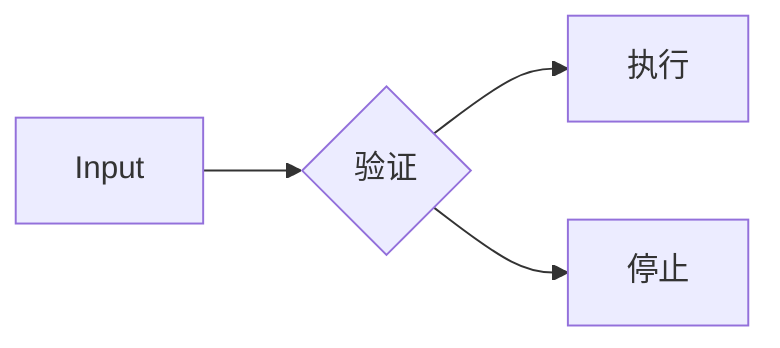
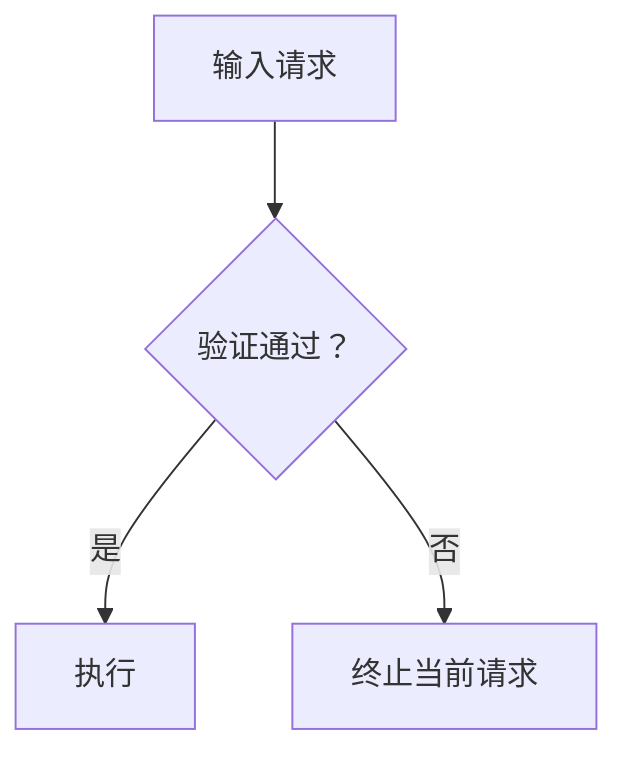

<!-- APCF-META {"schema":1,"visibility":"public"} -->
## 1. 中文句号禁用

**原则**

- 自行生成的中文正文、标题和列表不得使用中文句号 `。`

**触发**

- 新写、改写或局部修复中文时，检查全部非受保护区域，包括本次局部改动

**必须**

- 句中 `。` 后仍有内容时，先按第 10 条判断语义；仍需在同一连续单元内保留明确句界时改为 `；`，仅需短停顿时用逗号，已构成独立项目或主题时按第 6—9、11、28 条分开，不得直接删掉句界造成粘连
- 段落、标题或列表项末尾的 `。` 直接删除，不补其他句末标点

**例外**

- 第 12 条规定的受保护内容保留原有 `。`，不按正文偏好修改

**Bad**

```markdown
当前检查尚未结束。需要等待检查结果
```

**Good**

```markdown
当前检查尚未结束；需要等待检查结果
```

**Bad**

```markdown
当前检查已经结束。
```

**Good**

```markdown
当前检查已经结束
```

## 2. 英文名称缩写大小写

**原则**

- 保留英文名称、类别或缩写时，先确认身份，再统一大小写；正式写法优先

**触发**

- 英文需要保留时，区分有正式写法的名称或缩写、没有特殊正式大小写的普通名称或类别，以及完整英文句子；不得凭几个单词自行制造缩写

**必须**

- 品牌、产品、软件、平台、协议、标准及其他正式名称和缩写必须保持已确认的官方大小写
- 没有特殊正式大小写的普通英文名称或类别使用标题式大小写（Title Case），主要实义词首字母大写，同一名称保持一致
- 完整英文句子使用正常英文句法，不把普通单词全部标题化
- 无法确认官方形式时，保留可靠来源中的现有形式或停止正式化，不创造看似正式的拼写

**例外**

- 机器标识及受保护原文按第 12、15 条保持内部字符，不执行大小写统一

**Bad**

```text
NPM
IOS
EGPU
Scikit-Learn
```

**Good**

```text
npm
iOS
eGPU
scikit-learn
```

**Bad**

```text
design thinking
The System Is Currently Waiting For User Input
```

**Good**

```text
Design Thinking
The system is currently waiting for user input
```

## 3. 中英文名称缩写结构

**原则**

- 需要同时展示中英文名称时，固定其排列和括号职责，不自行选择其他混排形式

**触发**

- 名称第一次需要共同展示中英文时执行本条；存在正式缩写时，将缩写放在中文名称之前

**必须**

- 无正式缩写时使用 `中文名称（English Name）`；有正式缩写时使用 `ABBR 中文名称（English Full Name）`，不得换序、漏掉已要求保留的部分，或把英文全称放在中文之前冒充缩写并重复展示
- 中文全角括号只容纳对应英文全称，不含额外缩写、中文解释、定义、用途、备注或别名
- 结构中的英文名称直接使用普通文本，不额外加引号、粗体、斜体或代码标记；大小写按第 2 条
- 可完整展开的正式缩写必须使用正式完整展开，不以缩写替代其中应展开的单词

**例外**

- 符号或包裹本身属于正式名称、机器标识、逐字引用或用户指定原格式时保留，按第 12、15 条处理；名称作为第 27 条普通 BP 小标题时，可按该条使用必要结构性粗体，但不得改变本条中英文排列或再单独强调括号英文
- 官方递归缩写允许全称中包含缩写本身，不无限递归展开
- 外观类似缩写但没有可确认正式展开的名称，保留官方名称，不为凑齐结构补造全称

**Bad**

```markdown
Design Thinking（设计思维）
卷积神经网络（Convolutional Neural Network，CNN）
```

**Good**

```markdown
设计思维（Design Thinking）
CNN 卷积神经网络（Convolutional Neural Network）
```

**Bad**

```markdown
PTSD 创伤后应激障碍（“Post-Traumatic Stress Disorder”）
SQL 结构化查询语言（Structured Query SQL）
```

**Good**

```markdown
PTSD 创伤后应激障碍（Post-Traumatic Stress Disorder）
SQL 结构化查询语言（Structured Query Language）
```

**Bad**

```markdown
GNU GNU 非 Unix（GNU Not Unix）
npm Node 包管理器（Node Package Manager）
```

**Good**

```markdown
GNU GNU 非 Unix（GNU's Not Unix）
npm 包管理器
```

## 4. 普通英文中文化边界

**原则**

- 中文正文中需要保留英文对应的普通表达，以自然中文承担阅读语义，以括号英文保留对应关系

**触发**

- 英文表达普通动作、状态、对象、性质、程度、流程或关系，且不属于正式名称、专业术语或受保护内容时执行本条；所在领域专业，不等于该表达具有正式名称身份

**必须**

- 使用 `中文表达（English Expression）`，英文形式按第 2 条处理，不让普通英文直接裸露在中文句中
- 按整个短语在当前语境中的含义翻译，完整保留对应英文；不拆散固定短语、不沿用英文语序，也不为多义词永久绑定一个译词
- 同一句中的各个待自然化表达分别处理，各自保留英文对应，不漏处理或丢失其中任何一个
- 只改变表达形式，保留原有动作方向、状态、程度、范围和逻辑关系

**例外**

- 机器标识、日志、报错及其他受保护内容按第 12、15 条保留原文，说明写在外面
- 正式名称、缩写和专业术语交给第 2、3 条，不按普通英文强行中文化
- 没有稳定准确的中文对应，或中文化会损失必要含义时，保留英文并在外部自然解释，不造译名

**Bad**

```markdown
请先 check 当前配置
这个 issue 仍处于 open 状态
```

**Good**

```markdown
请先检查（Check）当前配置
这个问题（Issue）仍处于未解决（Open）状态
```

**Bad**

```markdown
将 `retry_count` 改名为 `重试次数`，只为让说明中文化
```

**Good**

```markdown
变量 `retry_count` 表示重试次数（Retry Count），标识本身不改名
```

## 5. 定义层级结构

**原则**

- 正式定义紧跟触发它的正文，换行缩进一级，以 `定义名词：定义内容` 独立呈现，末尾加入直观比喻

**触发**

- 只有当前内容实际承担解释概念“是什么”的任务时触发；在第一次需要解释的位置立即定义，不延迟到远处统一补充

**必须**

- 定义名词采用第 3 条中英文结构，随后用中文冒号连接定义内容；正式名称的真实性例外同样有效
- 每个定义独立占一个无序列表项，比其真实触发正文深一级；正文已嵌套时继续相对缩进，多个定义同级并列，不同行串联、不提升或压平；即使只有一个定义也保持这一特殊结构
- 首先说明“是什么”，再按实际理解需要依次补充功能、机制、成立或使用条件、相近概念区别，写成同一条连续定义；不拆成“定义／用途／原理”等子字段，不补无依据、不存在或无帮助的维度
- 每个定义末尾额外加入一句普通读者可理解的直观比喻，优先采用“直观来说，它就像……”；比喻对应核心结构、关系或运行方式，必要时限制类比范围，不以专业词替代比喻或制造错误等价
- 冒号后的内容直接解释含义，不机械重复名称中已经给出的英文全称或缩写

**例外**

- 用户指定词典、表格、Schema、法律条文或标准等固定定义载体时服从该载体；在其外自行补充解释仍须加入直观比喻
- 仅提到、翻译、引用或使用名称而不承担定义任务时，不追加定义
- 原始定义按第 12 条保留；需要解释时，在原文外另写符合本条的缩进定义和比喻

**Bad**

```markdown
处理器首先检查缓存（Cache）：暂存近期数据的区域，然后决定是否访问内存
```

**Good**

```markdown
处理器首先检查缓存，然后决定是否访问内存
  - 缓存（Cache）：暂存近期或高频数据的快速存储区域，用于减少重复访问较慢存储的等待；命中时直接读取，未命中时仍需访问下一级存储；直观来说，它就像把常用物品放在手边，但不是永久存放物品的仓库
```

**Bad**

```markdown
- 网络转发
  - 网关根据路由表选择下一跳
  - 路由表（Routing Table）：记录转发路径的数据结构
```

**Good**

```markdown
- 网络转发
  - 网关根据路由表选择下一跳
    - 路由表（Routing Table）：记录目标网络和转发路径对应关系的数据结构，供设备按目标地址选择下一跳或出口；直观来说，它像一张按目的地查询方向的路口指引表，而不是正在运输的货物
```

## 6. 并行项目强制分列

**原则**

- 共同从属于同一父项、处于同一层级并承担相同角色的独立项目必须分列；是否存在顺序另由第 7 条决定

**触发**

- 两个或以上同级原因、动作、对象、方案、事实、定义、约束、条件或步骤成立时触发；有执行或阅读顺序也不能压回散文
- 仅一个普通项目不构成并行关系；数量、相似外观、标点或动词数量不能代替层级判断，先按第 28 条确定独立性

**必须**

- 已确定的独立同级项目逐项换行，每项占一个同级位置，不用连接词或连续标点压在一行；标记形式按第 7 条或对应专门载体确定，不自行引入复选框
- 单一普通项目通过最小必要连接留在父级正文；同一原因与结果、对象与解释、条件与结论或主项与补充不为整齐而拆成并列
- 已有共同父项保留一次，直接子项同级排列；每项内部的条件、原因、结果和限定仍绑定该项，不被外层分列拆平
- 仅修复分列时，只改结构边界和必要标点，不新增引导语、分类、总结、解释或因果

**例外**

- 受保护原文及原始代码、日志、公式、表格的结构按第 12 条保持，只处理生成的解释
- 专门载体优先，包括第 5 条单个定义、第 20 条变量解释及第 28 条已限定的紧凑枚举；普通独立项目不能仅以“很短”为由免于分列

**Bad**

```markdown
当前只需要检查
- `timeout`
```

**Good**

```markdown
当前只需要检查 `timeout`
```

**Bad**

```markdown
本次失败有三个原因：配置文件缺失；服务没有启动；端口被占用
```

**Good**

```markdown
本次失败有三个原因：

- 配置文件缺失
- 服务没有启动
- 端口被占用
```

**Bad**

```markdown
- 请求失败
  - 代理地址填写错误
  - 因此目标服务器拒绝连接
```

**Good**

```markdown
请求因为代理地址填写错误而被目标服务器拒绝连接
```

## 7. 顺序项目强制编号

**原则**

- 两个或以上同级项目具有真实且需要保留的先后关系时，用连续有序编号直接表达次序

**触发**

- 执行、发生、检查、处理或阅读次序影响原意、结果或理解时触发；原文明确的阶段、优先级、推荐或阅读顺序，即使交换不会造成技术失败也必须保留

**必须**

- 按照真实依赖及原有时间、阶段、优先级、推荐或阅读次序连续编号，保留固定阶段标识的顺序含义，不自行交换
- 只有一个步骤时直接用自然正文，不创建单项 `1.` 列表
- 有序子项目继承父级编号，例如 `2.1`、`2.2`，再深一级使用 `2.1.1`；不得各层重新从 `1.` 开始或共用平面编号
- 纯顺序格式修复只增加编号、换行和必要标点，不增删、概括或解释项目；显示位置与原有明确阶段标识矛盾时，只按原有标识恢复顺序，不另定次序

**例外**

- 无顺序的同级项目按第 6 条处理；第 16、19、20 条规定的组成映射按各自载体形式保留原出现顺序，不将组成解释误写成执行步骤
- 受保护材料按第 12 条保留，只在外部说明中使用编号

**Bad**

```markdown
1. 重新启动服务
```

**Good**

```markdown
重新启动服务
```

**Bad**

```markdown
- 初始化环境
- 生成配置文件
- 启动服务
```

**Good**

```markdown
1. 初始化环境
2. 生成配置文件
3. 启动服务
```

**Bad**

```markdown
1. 准备环境
2. 安装依赖
   1. 安装 Python 依赖
   2. 安装前端依赖
3. 启动项目
```

**Good**

```markdown
1. 准备环境
2. 安装依赖
   2.1 安装 Python 依赖
   2.2 安装前端依赖
3. 启动项目
```

## 8. 父子项目层级缩进

**原则**

- 真实父子关系通过换行和逐级缩进表达，直接子项必须挂在真正控制其范围的父项下

**触发**

- 父项提供共同范围、前提、类别或说明，子项只在该范围内成立时触发；子项再含下一级项目时继续相对缩进

**必须**

- 父项独立保留，直接子项同深度换行缩进一级；每个真实下一级再加一级，不跳级、不压平、不把孙项挂回祖先；已有外层列表不免除内层结构
- 作用于多个子项的说明写在共同父级，不放在最后一个子项后制造归属歧义
- 纯层级修复只调整换行、缩进和必要列表结构，不新增父级概括、分类、解释或关系

**例外**

- 同级项目按第 6、7 条处理；仅为连续原因、结果、限定或解释时不因句长而缩进，单一普通子项和特殊定义分别按第 6、5 条处理
- 代码、日志、引用、表格、公式等受保护结构按第 12 条保持

**Bad**

```markdown
请求配置包括
- 超时设置
- `connect_timeout`
- `read_timeout`
- 重试设置
- `max_retries`
- `backoff`
```

**Good**

```markdown
请求配置包括：

- 超时设置
  - `connect_timeout`
  - `read_timeout`
- 重试设置
  - `max_retries`
  - `backoff`
```

**Bad**

```markdown
发布检查必须在正式发布前完成

- 测试全部通过
- 文档已经更新
- 所有检查基于同一个候选版本
```

**Good**

```markdown
发布检查必须在正式发布前基于同一个候选版本完成

- 测试全部通过
- 文档已经更新
```

## 9. 标题编号、层级、伪标题禁用

**原则**

- 真实内容区块使用带层级序号的 Markdown 标题，编号深度和标题深度共同反映结构，不以视觉标签伪造标题

**触发**

- 内容形成需要独立边界的主题、阶段、对象或子区块时使用标题；短文字实际命名后续区块即属于标题，不论其外观；仅为提示、结论或正文局部内容时不建标题

**必须**

- 所有标题含 Markdown 标记和层级序号；同级连续编号，子级继承父号并同步加深标记，例如 `## 2.`、`### 2.1`、`#### 2.1.1`，兄弟区块保持同深度
- 承担分区作用的 `操作：`、`**性能测试**`、`【已知限制】`、`结果——` 等改成正式标题；没有独立区块则恢复正文，不为突出一句话建立标题
- 标题只保留准确定位区块的名称，完整解释、原因、过程和结论放在正文
- 纯标题修复仅改标记、编号、层级及必要的标题正文分离，不新增章节、总结或解释
- 完整自然句引出列表、引用、代码或示例时仍是正文，可以使用冒号；句末冒号不是判断标题的依据

**例外**

- 原文、代码、日志、界面文字等受保护内容按第 12 条保持
- 用户指定的出版、法律或外部文档编号模板优先；本文件按用户要求保留的 `原则 / 触发 / 必须 / 例外 / Bad / Good` 是固定栏目，不改成新标题体系
- 第 27 条同一 BP 内的 `- **小标题**：正文` 是局部标记而非分区标题；第 5、15、20 条的对象与解释映射冒号也不属于伪标题

**Bad**

```markdown
## 系统架构

#### 2.1 请求处理

**存储方式**

数据保存在文件中
```

**Good**

```markdown
## 2. 系统架构

### 2.1 请求处理

### 2.2 存储方式

数据保存在文件中
```

**Bad**

```markdown
### 3.1 需要检查以下两项

- 内存占用
- 磁盘剩余空间
```

**Good**

```markdown
需要检查以下两项：

- 内存占用
- 磁盘剩余空间
```

## 10. 分号连续逻辑边界

**原则**

- 分号只分隔同一行内需要共同阅读的连续语义，不代替独立项目、步骤、段落或标题结构

**触发**

- 多个分句拟保持同行、定义内部需要连续解释，或正在处理第 1 条句号时，先按第 28 条判断是否同一单元，再决定逗号、分号或结构分隔

**必须**

- 同一连续单元确需比逗号更明显的边界时才用 `；`；短停顿、自然补充或紧密衔接优先用逗号
- 独立同级项目按第 6、7 条分列；不同主题按第 9、11 条分区或分段；连续多个分号时重新检查，不能因禁用句号制造超长分号链
- 定义中的分号只连接同一个定义对象的紧密说明，保持一个定义块，不合并不同定义对象
- 纯分隔修复只改必要标点、换行和已有结构，不新增解释、总结、分类或因果

**例外**

- 受保护材料和机器字符串中的分号按第 12、15 条保持
- 已由专门规则确定的列表、编号、标题或定义结构优先，分号不得覆盖这些结构

**Bad**

```markdown
请求进入路由器；读取配置后选择目标后端
```

**Good**

```markdown
请求进入路由器，读取配置后选择目标后端
```

**Bad**

```markdown
部署流程包括：停止旧服务；更新配置；启动新版本；执行健康检查
```

**Good**

```markdown
部署流程包括：

1. 停止旧服务
2. 更新配置
3. 启动新版本
4. 执行健康检查
```

## 11. 段落空行边界

**原则**

- 空行只表示真实段落或独立块级边界，统一保留一个；同一连续列表不靠额外空行拉开版面

**触发**

- 主题切换、正文和独立块级对象相邻、列表内部出现空行或连续空行时，检查其真实边界

**必须**

- 不同主题分别成段，独立正文、标题、列表、代码块、引用、表格、图片和公式块之间保留一个空行，包括正文进入列表、列表结束后续正文及标题后的边界
- 同一列表的同级项目之间、父列表项和直接子列表之间不插空行，除非该位置确实开始新的独立区块
- 普通生成正文中连续两个以上空行压成一个，行尾不保留空格或制表符
- 局部修改把行内内容变为块级结构时，同次补齐前后必要边界，不留下粘连

**例外**

- 受保护空白按第 12 条保持；正式载体、代码语言或用户指定格式要求的内部空行不按普通正文压缩
- 同一列表、父子结构或连续结构中的单纯换行不自动产生空行

**Bad**

```markdown
需要检查以下两项：
- 配置文件

- 服务状态
检查完成后再启动服务
```

**Good**

```markdown
需要检查以下两项：

- 配置文件
- 服务状态

检查完成后再启动服务
```

**Bad**

```markdown
- 请求配置

  - 超时设置
  - 重试设置
```

**Good**

```markdown
- 请求配置
  - 超时设置
  - 重试设置
```

## 12. 受保护内容原样保持

**原则**

- 承担逐字原文、原始证据、可执行内容或用户指定原貌的对象必须保持内部原样；普通写作规则只作用于保护区域之外

**触发**

- 展示逐字原文或证据、需要保持语法行为的代码和机器内容，或用户明确要求原样保留时，标明受保护范围
- 同一输出含原文和解释、总结、翻译或分析时，区分受保护副本、允许转换的输入和生成结果，不将三者混同

**必须**

- 受保护对象的字词、数字、大小写、标点、空格、Tab、换行、缩进、组成顺序和机器结构逐项保持；不翻译、补全、缩写或规范化路径、URL、命令、字段及代码标识，不因排版改变内部组织
- 保护边界在最终输出中可识别，新增解释、注释、评价、翻译或结论置于外部；授权派生版本与原始副本分开，不覆盖或冒充原文
- 与普通格式规则冲突时，仅保护区域内部以原样保持优先，外部正文仍执行适用规则

**例外**

- 用户明确授权翻译、改写、润色、纠错、重排或修改的指定范围可以变换，未授权范围仍受保护；同时展示的原始副本不随派生版本改变
- 载体转换可在外部增加引用或代码包围标记，不改内部内容；第 22 条有标识的选段或删节只适用于未要求完整原样展示的引用，不冒充完整副本
- 未授权修正时，即使原文有错误、异常空白、大小写或标点也保留，在外部指出，不静默纠正

**Bad**

```text
要求原样保留的文本被统一成：
The server is down
```

**Good**

```text
原文：
The Server Is Down。
```

**Bad**

```text
要求保留原句并给出改写
原句：Model A improves accuracy.
改写：模型 A 可以提高准确率
```

**Good**

```text
要求保留原句并给出改写
原句：Model A may improve accuracy.
改写：模型 A 可能提高准确率
```

**Bad**

```text
用户要求把 The request timed out. 翻译成中文，却因原文保护而拒绝翻译
```

**Good**

```text
用户要求翻译时，转换结果可以写为“请求超时”；只有同时要求展示的原始副本仍须逐字保留
```

## 13. BP 内容单元标准逻辑链

**原则**

- BP 内容单元按「问题 → 需求 → 决策 → 任务 → 验证 → 证据 → 完成状态」形成连续逻辑，不只孤立陈述动作或结果

**触发**

- 生成、重写、整理或检查 BP 时，核对适用信息是否保持上述顺序

**必须**

- 问题说明当前需要解决、解释、改变或确认的情况
- 需求说明为什么处理该问题，以及产生什么目标或要求
- 决策说明据此选择的方向、方案或判断
- 任务说明落实决策所需的实际动作
- 验证说明怎样判断动作是否实现预期结果
- 证据说明支持验证结论的实际信息
- 完成状态根据验证和证据说明当前结果
- 相邻节点可自然合并，但其先后、因果和判断依据仍可识别，不逻辑跳跃、不为凑齐模板虚构节点；具体小标题和非标签化表达按第 27 条
- 一条 BP 围绕一条问题链，独立问题按第 28 条拆开

**例外**

- 名称、参数、文件、对象或选项等纯原子枚举不强制形成完整因果链；定义、CHECKLIST、命令组成、代码、机器字段、公式及图中元素的专用顺序分别按第 5、14、16、17、19、20、25、26 条，不另追加一套七节点
- 受保护 BP 按第 12 条保持

**Bad**

```markdown
- 已经修改代码，所以功能完成
```

**Good**

```markdown
- **功能验证**：当前功能缺少目标行为，因此需要修改实现；代码修改只是任务动作，仍需实际行为验证及对应证据，才能确定完成状态
```

**Bad**

```markdown
- **文件**：为了完整表达问题和证据，为 `config.yaml` 编造一条问题链
```

**Good**

```markdown
- `config.yaml`
- `README.md`
```

## 14. CHECKLIST 内容单元标准逻辑链

**原则**

- CHECKLIST 按「完成状态 → 对象 → 触发或条件 → 问题或机制 → 后果 → 单一要求 → 客观判据」表达当前承诺及完成依据

**触发**

- 生成、重写、整理或检查 CHECKLIST 项时执行本条，不把第 13 条普通 BP 顺序再叠加一次

**必须**

- 完成状态表达该项实际状态，对象明确其具体约束内容
- 触发或条件说明何时成立，问题或机制说明要求的成因，后果说明不处理将造成的结果，三者须真实对应
- 每项只承载一个可独立判断完成与否的主要要求，并给出直接对应、可观察或可比较的客观判据；多个独立要求拆项，状态不能靠模糊评价或无关结果确定
- 七节点保持规定顺序和完整对应，相邻节点可合并表达，但不漏决定完成判断的信息、不拼接无关内容，也不制造客观不存在的条件

**例外**

- 极简单子项可继承共同父级已经明确的条件或机制，但自身状态、对象、单一要求和客观判据必须可识别
- 受保护 CHECKLIST 按第 12 条保持

**Bad**

```markdown
- [ ] 优化上传功能
```

**Good**

```markdown
- 【进行中】【文件上传】：当用户上传支持格式文件时，因临时文件会在后续读取时丢失，必须保证上传结果持久保存，并以上传后能够重新读取且内容一致确认通过
```

**Bad**

```markdown
- 【已完成】【搜索】：看起来已经正常
```

**Good**

```markdown
- 【已完成】【搜索结果】：当用户提交有效查询时，因结果缺失会使搜索无法完成目标，必须返回符合查询条件的结果，并以实际查询返回预期数据确认通过
```

## 15. 机器标识行内代码格式

**原则**

- 字符形式本身具有程序、配置、接口或文件系统含义的机器字符串，使用行内代码明确字面边界

**触发**

- 正文直接讨论字段、参数、变量、函数、类、配置键、环境变量、路径、原始 URL、代码字面量或表达式，且精确字符用于复制、搜索、输入或定位时触发
- 普通名称、概念、自然语言缩写和业务编号不因技术外观触发；完整命令或多行代码、日志、配置交给相应块级规则

**必须**

- 反引号包住完整机器字符串，仅增加外部展示边界；内部拼写、大小写、分隔符、扩展名、参数和空白按第 12 条保持，不执行普通标点、术语中文化或中英文空格统一
- 字面类型及代码值、运算式保留程序形式，例如 `int`、`uint32_t`、`std::string`、`null`、`true`、`0`、`n - 1`；普通概念、计数或真假表述不因此变成代码
- 同一语义下的机器字符串统一标记，不把反引号用作普通强调
- 原字符串含反引号时使用可正确表示它的 Markdown 定界方式，不删原字符迁就语法

**例外**

- 产品、品牌、协议、标准、学科、算法等名称按第 2、3 条；主要供人阅读的审计、复核、订单或票据编号不自动代码化
- 导航链接按第 29 条，描述性文字不因目标是 URL 而代码化；链接文字本身是机器字符串时按该条组合格式边界处理
- 用户指定普通文本、表格字段或其他媒介时服从指定呈现，但内部字符不静默改变
- 完整命令的展示和组成说明按第 16 条，本条只规定其中单独出现的机器标识

**Bad**

```markdown
修改 timeout，将 CUDA_VISIBLE_DEVICES 设置为 0
```

**Good**

```markdown
修改 `timeout`，将 `CUDA_VISIBLE_DEVICES` 设置为 `0`
```

**Bad**

```text
把产品名 TensorFlow 和复核编号 B23 都套成代码
```

**Good**

```text
产品名 TensorFlow 和复核编号 B23 不因包含英文或数字而使用行内代码
```

## 16. 命令组成逐项解释

**原则**

- 先展示可复制的完整命令，再按其原出现顺序逐项解释有独立作用的组成；说明能映射回命令，不拆散可执行本体

**触发**

- 展示含解释器、程序、脚本、子命令、位置参数、选项或参数值的命令时应判断组成解释；读者不能可靠理解作用时必须拆解；独立参数分项，选项和绑定值作为一个单元，不只解释带短横线的选项
- 受保护命令只在外部增加解释，原命令按第 12 条保持

**必须**

- 完整命令先作为整体代码对象呈现，保持真实可执行字符、参数顺序、参数值及必要空格，不为解释重排
- 每个有独立作用的组成按命令顺序占一条 BP，真实子结构才继续缩进；选项和绑定值默认合为一项，例如 `--port 8000`，最终每项均能定位回原命令片段
- 每项先说明是什么，再按第 13 条的适用逻辑自然交代为什么需要、承担什么作用、怎样影响执行；相邻节点可合并，不机械展开七标签，不编造不存在的问题或状态
- 可观察时给出对应验证方式，如日志、进程、端口、文件或响应；未实际执行、验证或取得证据时，只说明预期作用和可用验证方式，不写成已经成功
- 仅解释命令实际包含的组成和真实子结构，不补造参数、默认值或行为，也不机械拆分不可分割的配置含义；机器标识按第 15 条

**例外**

- 极简单且上下文已明确的单一命令可省去无信息解释；用户明确只要可复制命令时只展示完整命令
- 受保护原命令仍按第 12 条，不因解释需要修改
- 密码、令牌、密钥等敏感值不得为逐项解释再次展开，只解释允许安全展示的组成
- 参数真实作用无法从上下文或可靠来源确定时，说明无法确认，不根据名称猜测

**Bad**

````markdown
```bash
pytest tests/test_api.py -q
```

这条命令运行测试
````

**Good**

````markdown
```bash
pytest tests/test_api.py -q
```

其中各组成部分含义如下：

- `pytest`：调用 Python 测试运行器处理指定目标，正常进入测试收集是其可用前提
- `tests/test_api.py`：把测试范围限定为这个文件，结果应来自该目标，而不是整个测试集
- `-q`：使用精简输出，只改变展示详细程度，不改变测试是否执行
````

## 17. 代码内生解释规范

**原则**

- 真实源码同时承担执行、人类阅读和文档来源，按「代码单元 → 参数 → 逻辑块 → 必要语句」四层提供最小充分解释，不默认维护另一份教学代码

**触发**

- 新生成代码立即注释；实质修改时同步检查所属最小完整语义单元；深度读取实现并据此判断、设计、定位问题或生成后续内容时，仅在允许修改源码的前提下补齐该单元明显缺失的必要解释
- 搜索命中、符号索引、文件扫描、简单签名读取或短暂浏览不构成深度触达
- 影响行为的参数、配置、硬件参数和接口端口逐项解释；语句不能直接表达原因的重要机制建立逻辑块说明，上层仍未覆盖的独立原因、边界、副作用或顺序约束才增加语句说明

**必须**

- 各语言沿用四层信息职责，只按语言改变合法注释语法；稳定接口信息优先使用可提取的原生文档注释，例如 Python 文档字符串、Doxygen、Javadoc、Rustdoc 或硬件代码邻近注释
- 代码单元说明按「一句话目的 → 问题或需求 → 核心决策或机制 → 参数 → 返回或输出 → 失败边界 → 副作用 → 按需示例」展开，让读者先理解目的和机制；不存在的字段直接省略
- 一句话目的默认 1—2 行，问题、需求或核心机制合计默认 1—3 行
- 单个参数默认 1—2 行，有默认值、重要边界、行为差异、特殊值、失败条件或明确验证方式时可扩展到 3 行
- 逻辑块默认 1—3 行，说明条件、处理需要、机制和影响；语句说明默认 1 行，确需同时说明特殊原因和直接后果时可用 2 行
- 超预算先去重并判断是否应提升解释层级；同一事实只在主要层级解释，下层只补新信息；仅正确性、安全、协议、时序、资源生命周期等不可丢失信息无法准确容纳时才超预算
- 注释与实现同步维护；签名、参数、结果、错误路径、副作用或行为变化后，复核默认值、单位、位宽、时间、重试边界、协议和状态条件，不保留陈旧说明
- 每个真实输入按名称映射，压缩说明为什么需要、为什么采用当前形式或取值、控制什么、重要边界及可观察结果；有单位、默认值、范围、特殊值、互斥或联合条件时必须说明，显著行为变化不得遗漏；按第 13 条只保留真实稳定信息，验证方向可写返回值、日志、监听、寄存器或文件，不能伪造某次测试通过
- 返回值解释结果含义而非只复述类型；重要失败路径解释触发条件而非只列异常名；文件、数据库、缓存、网络、线程、寄存器等外部可观察变化说明重要副作用
- 逻辑块说明放在覆盖代码之前或邻近位置，优先解释代码无法表达的“为什么”，交代条件、需求、机制和影响，不在内部简单语句重复同义说明
- 语句说明只写独有且不直观的信息，不逐行翻译代码；上层已覆盖的赋值、返回、调用、递增或结构语法可无独立注释，空行和纯闭合符不得机械注释；合理解释覆盖不等于每行都有同行注释
- 魔法数、协议常量、等待时间、容量、位宽和周期等来源不直观时解释取值原因；发现代码缺陷则在授权内修正或保留真实问题，不用注释把错误合理化为设计意图
- 新代码随生成完成解释，不另欠注释任务；已有代码治理止于实际修改或深度触达的最小完整语义单元，不扩展到无关文件或全仓库，不为仅搜索命中的代码补注释，禁止修改源码的任务不改变源码
- 测试、业务、脚本、硬件描述和系统代码使用相同四层结构；准确测试名可减少简单测试重复说明，但复杂夹具、特殊条件和重要断言原因仍需解释

**例外**

- 极短私有辅助函数的目的、输入和结果已由名称及签名完全表达时，可省无信息长说明；极简单测试名已涵盖对象、条件和结果时同理
- 第三方、自动生成、内置第三方副本及用户指定原样代码按第 12 条保护；只读任务不插入注释
- 不接受合法注释的格式按第 19 条外置解释；已确定必要的同行注释按第 18 条对齐，不反向增加注释
- 用户明确要求裸代码时可缩减注释，但不据此声称完整满足本条
- 确需超出默认预算时按本条重要信息例外处理，仍须去重

**Bad**

```c
if (buffer == NULL) {
    return -1;  // buffer 为空就返回 -1
}
```

**Good**

```c
// 后续解析会解引用 buffer，因此在入口拒绝空指针，避免非法内存访问
if (buffer == NULL) {
    return -1;
}
```

**Bad**

```python
count += 1  # count 加一
result = transform(item)  # 转换 item
return result  # 返回 result
```

**Good**

```python
count += 1
result = transform(item)
return result
```

**Bad**

```text
仅搜索到 retry_limit 的 43 个文件，就开始为全部文件补注释
```

**Good**

```text
仅搜索不触发注释补全；随后完整读取并用于技术判断的 run_job()，在允许修改源码时才进入本轮最小单元治理范围
```

## 18. 同行注释列对齐

**原则**

- 同一代码块中两个以上必要同行注释按代码实际显示宽度对齐；只调整代码末尾和注释标记之间的分隔空白，不改变程序或注释含义

**触发**

- 第 17 条已确定必要同行注释后，按当前块计算目标列；参与行长度或参与集合变化时重算，有 Tab 或宽字符时按显示列计算
- 目标语言或格式不允许合法同行注释时不执行

**必须**

- 每个独立代码块单独计算，仅必要同行注释对应的语句参与；未注释长行、空行、纯闭合符和结构括号不影响目标列
- 先去掉代码尾部无意义空格或 Tab，再计实际显示宽度，不能用字符数替代；Tab 使用四列制表位并推进到下一个四列边界，中文、全角及其他宽字符按实际显示单元计算
- 以首列为第 1 列，参与代码的最大显示宽度记为 $L$，所有注释标记从第 $L+2$ 列开始；当前代码宽度为 $W$ 时补 $L-W+1$ 个普通空格，最长行仍有一个分隔空格
- 新增对齐字符只允许为分隔普通空格，保留原缩进、代码内部空白、Tab、字面值、操作符布局和逻辑，注释仍跟随原语句位于同一物理行
- 注释使用当前语言合法语法，字符串内的 `#`、`//`、`--` 等不能当作注释起点；说明过长时回到第 17 条使用逻辑块等合适层级，不无限延长同行注释
- 变更任一参与行或集合后复验全块目标列；本条只检查位置，不证明必要性或内容正确，更不能为对齐增加原本不需要的注释
- 受保护代码未经授权不得修改空白，按第 12 条

**例外**

- 只有一个必要同行注释时，不建立跨行对齐，只保留正常分隔
- 没有同行注释、只有块级或文档注释，或格式不支持时不适用
- 第三方、自动生成或受保护代码保持原样；超出同行承载能力的说明改用第 17 条其他层级

**Bad**

```python
short = 1          # 基准测试输入
much_longer_name = 2          # 覆盖长名称
x = 3          # 第三个测试输入
```

**Good**

```python
short = 1            # 基准测试输入
much_longer_name = 2 # 覆盖长名称
x = 3                # 第三个测试输入
```

**Bad**

```python
message = "http://example.com" // 默认服务地址
value = parse(message)      # 解析结果供后续使用
```

**Good**

```python
message = "http://example.com" # 默认服务地址
value = parse(message)         # 解析结果供后续使用
```

## 19. 不可注释格式外置解释

**原则**

- 格式或真实下游不接受注释时，保持机器本体合法完整，把解释放在块外并按原结构映射，不以伪注释破坏兼容性

**触发**

- 严格 JSON、JSON Lines 等不支持注释的格式，或解析器、协议、接口、消费者要求无注释输入时执行；任何会使真实工具无法解析、导入、校验或执行的解释字符都不能插入本体
- 需解释字段、数组、层级或重要取值时按真实结构展开；受保护机器内容按第 12 条原样保持

**必须**

- 先完整展示可复制保存或提交的合法目标格式，再在外部说明；不插入不支持的 `//`、`#`、`/* */`，不擅自把严格 JSON 换成 JSONC、JavaScript 对象或 YAML
- 说明按原出现顺序，用真实字段、对象、数组或取值作为入口，机器标识按第 15 条；不因解释改变字段顺序、名称、数值、大小写或数据类型
- 字段说明优先交代为什么需要、控制什么、当前设置原因及重要边界或影响，按第 13 条只表达真实支持的信息，不编造验证、证据或状态；简单字段默认 1—2 行，含默认值、单位、范围、特殊值、嵌套或显著行为影响时可到 3 行
- 共同背景放在父级，嵌套子字段继续缩进；同语义数组先解释整体，只展开特殊元素，不复制同类值说明；不同角色元素分别解释
- 布尔字段说明 `true` 和 `false` 的实际行为区别，数值有单位或边界必须说明；`null`、空字符串、空数组、`0` 等特殊语义依据实现确认，不凭常识填补；枚举先解释当前值，仅任务需要选择空间时展开其他候选
- 机器内容变化后同步复核外置说明，错配不能视为满足可读性；可由 JSON Schema、OpenAPI 或协议结构生成字段文档时优先复用同一来源，不平行维护定义；按阅读需要解释，明显字段可由名称和父级覆盖，不遗漏重要行为、边界或非直观值

**例外**

- 用户只要原始机器文件时可只交付合法原文；名称已完整表达含义且无特殊边界或行为时，可用极短说明或共同父级覆盖
- 受保护内容按第 12 条；目标格式和消费者确实接受注释时回到第 17 条，不强制外置
- 巨型数据仅解释结构、重要字段、特殊元素和边界，不逐值复述；二进制、压缩数据等用结构、Schema 或高层元数据说明，不要求逐字解释

**Bad**

````markdown
```json
{
  // 重试设置
  "retry": {"enabled": true, "limit": 3, "delay_ms": 500}
}
```
````

**Good**

````markdown
```json
{
  "retry": {"enabled": true, "limit": 3, "delay_ms": 500}
}
```

这些字段定义重试配置：

- `retry`：定义暂时性失败后的重试策略
  - `enabled`：`true` 允许符合条件的失败再次尝试，`false` 不启用该重试路径
  - `limit`：当前为 `3`，表示总尝试次数还是首次失败后的额外重试次数须由实际实现确认
  - `delay_ms`：相邻重试间等待 `500 ms`，改变此值会改变重试节奏
````

**Bad**

```markdown
`fallback` 为 `null`，所以一定禁用备用方案
```

**Good**

```markdown
`fallback` 为 `null`，其真实行为须从消费实现或正式 Schema 确认，不能自行认定为禁用备用方案
```

## 20. LaTeX 公式解释规范

**原则**

- 有实际数学、工程或科学含义的公式，按「前置连续讲解 → 完整公式 → 变量或组件 BP → 后置连续讲解」解释；整体推理用自然正文，不用标签化字段代替

**触发**

- 公式是主要推理、计算或结论依据，含首次有意义的组件、独立组分或组合关系，或具有条件、单位、维度、近似、稳定性、失效边界及多式依赖时，分别解释对应内容
- 同作用域和同含义的重复公式引用已有解释，只补实际变化

**必须**

- 前置讲解在公式前用一个简短自然段，默认 1—3 行，说明问题、为什么采用该关系及目标结果，可概括输入输出；不逐项定义变量、不朗读公式、不用“问题／作用／输入”等冒号标签，必要背景可扩展但不抢占后置组分职责
- 完整正式公式随后展示，说明置于本体之外；不以自然语言、代入、展开或简化版替代，也不擅改变量、上下标、分组、符号或命令；简单局部关系可行内，需要变量或组分解释时独立成块，多行使用合法环境，边界按第 11 条，保护按第 12 条；仅原文已有、后续需引用或用户要求时保留或新增公式号
- 首次有独立意义的变量、常数、参数、向量、矩阵、函数或上下标各用一条 BP，形式可为 `$x$：……`；自然说明身份、所代表内容、当前作用、必要性及边界，不只换中文名称、不拆子字段；简单组件一句，复杂组件可两句，仅有单位、维度、范围、来源或硬边界需要时继续增加
- 单位存在时必须说明；维度影响合法性时说明关系；上下标的样本、时间、类别、层级或坐标含义就近解释，参数明显改变行为时说明调节作用
- 同作用域同含义不重复定义，换作用域且含义变化则重新定义；普通括号、等号、基础运算符和纯排版命令不机械列为 BP
- 变量 BP 后继续自然正文，按真实数学依赖解释每个独立组分的组成、组合原因、中间作用、连接、结果影响和边界；不使用“分子／第一步／结果”等伪标题，不复述变量定义，不编造不存在的节点
- 分子和分母职责不同时分别说明并解释取比原因；求和说明单个累加对象及总体量；差分说明比较对象和偏离含义
- 加权说明相对贡献，归一化说明原量、缩放基准和所得性质；平方、绝对值、范数、对数、指数、积分、微分或矩阵运算承担核心机制时解释变换原因；系数、权重、超参数及特殊常数有实际作用或数学原因时说明，各组分怎样形成整体结果必须清楚
- 多公式链解释中间结果如何进入下一式，最终收束到完整公式的数学或现实含义；有明确方向时说明关键输入趋势，有自然极端情况时可用其检查；存在单位、维度、范围或数量级等合理性判据时说明关键检查方式
- 真实存在的除零、对数或开方定义域、矩阵维度、可逆性、概率范围、稳定性等硬边界，以及线性、独立性、连续性、稳态、对称性或正定性等成立条件必须说明，不补无法确认的条件
- 前置承担整体问题和选择，变量 BP 承担局部身份与作用，后置承担组分机制、结果、验证方向及边界；三者共同完成逻辑，不再叠加第 13 条七标签，不用详细解释制造已经实测的印象
- 核心公式保留完整顺序；简单公式可减少组件和讲解，无复杂组分时后置可一段；附带公式可压缩但不漏首次重要变量与关键组分；重复只补新增变量、组分、条件或含义
- 数值演算仅教学、验证、比较或用户要求时增加；缺可靠数据则用明确标记的示例值或符号推导，不伪造实测

**例外**

- 紧邻上下文已定义所有变量的简单行内公式可不重列 BP；无复杂组分可缩短后置，但保留整体意义和边界；没有新增含义的局部代数变形可只说明变形目的
- 受保护原式按第 12 条；用户只要公式、结果或 LaTeX 源码时可省完整教学；正确性无法确认时保留该边界，不假装验证

**Bad**

```markdown
$$
\bar{x}=\frac{\sum_{i=1}^{n}w_ix_i}{\sum_{i=1}^{n}w_i}
$$

- $\bar{x}$：平均值
- $x_i$：样本
- $w_i$：权重
- $n$：数量

分子除以分母
```

**Good**

```markdown
不同样本的重要程度不同时，这条关系让各样本按权重参与平均，再用总权重消除整体权重尺度的影响

$$
\bar{x}=\frac{\sum_{i=1}^{n}w_ix_i}{\sum_{i=1}^{n}w_i}
$$

- $\bar{x}$：加权后的平均结果，与单个样本保持相同量纲
- $x_i$：第 $i$ 个样本值，下标区分它在整组输入中的位置
- $w_i$：对应样本的权重，控制其对结果的相对贡献
- $n$：样本总数，决定两个求和覆盖的共同范围

分子累计各样本乘以自身权重的贡献，分母累计同一批权重；除以总权重后，全部权重按同一非零倍数缩放不会改变结果

总权重非零时公式才有定义；各权重相同且非零时，它退化为普通算术平均
```

## 21. 行内数学 LaTeX 格式

**原则**

- 普通正文中的行内数学统一使用 `$...$`，一个连续数学关系尽量放在同一对分隔符中，不与代码或自然语言混同

**触发**

- 数学变量、上下标、向量、矩阵、函数、等式、不等式、比例、区间、集合、概率、极限、微积分、求和等使用数学格式；量值、百分比、角度、指数及科学计数等定量表达也按本条
- 需要多行、对齐、完整解释或独立空间时按第 20 条成块；字符实际是代码或机器标识时不触发数学转换

**必须**

- 行内分隔符成对，不混用 `\(...\)` 或裸数学符号，不机械加首尾空格，使用 `$x$` 而非 `$ x $`
- 连续关系尽量整体包裹，例如 `$x+y=z$`、`$0\le x\le1$`；独立数学对象被正文隔开时分别包裹，不把每个符号拆成碎片
- 单个变量及其上下标、上标完整置于数学环境，向量、矩阵和集合沿用当前公式记法，不将下标留在外部
- 关系符在数学环境内，优先使用 `\le`、`\ge`、`\ne`、`\in`、`\to`、`\infty`、`\nabla` 等命令；普通结构或流程箭头不因此数学化
- 函数使用 `\sin`、`\cos`、`\tan`、`\log`、`\ln`、`\exp`、`\min`、`\max`、`\lim` 等正式算子命令，自定义多字母算子在支持时用 `\operatorname{...}`；不把函数名排成多个斜体变量，条件概率优先用 `\mid`
- 变量保持数学模式的变量字体；描述标签用正体，如 `$V_{\mathrm{out}}$`，变量或样本、时间索引保持斜体，如 `$x_i$`；原式有明确约定时不擅改
- 单位用正式大小写的正体，与数值放在同一环境，默认以 `\,` 分隔，不拆单位内部；复合单位无歧义，百分号正确转义，例如 `$30\,\mathrm{ms}$`、`$100\,\mathrm{MHz}$`、`$\mathrm{m\,s^{-1}}$`、`$95\%$`、`$30.2\,^\circ\mathrm{C}$`
- 普通计数、日期、版本、章节、文件数量或编号不用数学格式；进入运算、比较、区间、比例、量值或公式关系后才与对应内容共同包裹，不机械处理全文所有数字
- 中文句法标点放在环境外；坐标、元组、集合或分段条件内部有数学意义的标点可以保留，数学结束后立即回到正文
- 自然语言解释留在环境外；只有不可分离的内部文字标签才使用受支持的 `\text{...}` 等命令，`\mathrm{...}` 优先用于单位和短正体标签，不把整句解释塞入数学环境
- 百分号、下划线、花括号及美元等特殊字符按目标数学语法处理；普通货币美元符号不是分隔符，需要显示字面美元时按实际渲染器转义，避免破坏后续配对
- 行内不得嵌套 `$...$` 或跨自然段；多行对齐、复杂分式链、多个独立等式、长推导或待逐项解释的核心关系按第 20 条成块，按职责而非单纯字数判断
- 代码对象按第 15 条，数学对象按本条；不因代码含下划线改成下标，路径、URL、命令、日志和配置键不转换；身份无法确认时保留当前语义类型，不凭外观判断
- 受保护数学按第 12 条保留原分隔形式，只有用户授权改写或重排的数学正文才统一

**例外**

- 独立公式使用 `$$...$$` 或目标正式独立环境，不使用单个 `$...$`
- 受保护对象、代码内字符、普通货币符号及无数学职责的数字不触发；指定逐字保留的其他分隔形式不替换
- 目标环境明确不支持 `$...$` 时用其真实等价语法，不生成已知无法渲染的内容

**Bad**

```markdown
变量 x_i 满足 $x$_i ≥ 0，延迟为 30ms
```

**Good**

```markdown
变量 $x_i$ 满足 $x_i\ge0$，延迟为 $30\,\mathrm{ms}$
```

**Bad**

```markdown
使用 $sin(x)$；共有 $3$ 个文件，版本为 $2.1$
```

**Good**

```markdown
使用 $\sin(x)$；共有 3 个文件，版本为 2.1
```

**Bad**

```markdown
参数 retry_limit 是 $retry_limit$，表示数学下标
```

**Good**

```markdown
代码参数 `retry_limit` 保持机器标识，对应数学量另记为 $r$
```

## 22. 引用格式

**原则**

- 逐字引用与生成解释保持明确边界；独立原文用引用块，嵌入句子的极短措辞用行内引号，来源和解释放在对象外

**触发**

- 完整原句、连续句或段落及需核对的用户原话使用引用；具体措辞影响判断时应引用，极短词语可行内，仅表达意思则用释义或摘要；代码等机器对象使用自身格式

**必须**

- 独立逐字文本用 `>` 后一个普通空格的引用块，前后边界按第 11 条；不因重要而使用引用样式，不把生成的摘要、提示或结论伪装成原话
- 引用内部按第 12 条保持原字符、标点、数学及机器标识，仅加外部展示标记，不以中文句号、术语或其他格式规则重写
- 同一连续来源保持连续引用块及原有段落、空段和真实嵌套；不压平、不任意删换行，也不把同一连续多段来源拆成无关对象
- 来源在引用外就近标明，除来源名称本就在原文中外不写入引用块；只记录已确认元数据，优先精确页码、章节、段落、条款或时间，无法精确定位则保留已确认层级；真实链接按第 29 条，外部来源编号按第 23 条，平台引用标记也就近对应
- 引用前可用自然句说明查看目的，后续解释另起普通段落，不继续使用 `>` 或插入“这说明”等生成文字；逐段分析先展示对应原文再外置解释，仅用户明确要求逐句对照时逐句交替
- 可嵌入句子的极短原词用中文外层双引号 `“……”`，需要第二层边界时用 `‘……’`；引号仅为外部标记，原片段已有引号不删除；完整独立句、需核对证据、多逻辑单元或打断阅读时改用引用块
- 代码用行内代码或围栏代码块，日志、命令输出及机器数据用围栏代码块，不再额外套普通引用块；表格、图片和公式保留各自格式，来源仍外置
- 任务允许选段或删节时，保留部分逐字对应，非连续内容之间使用明确删节标记如 `[…]`；必要极短编辑澄清用可区分的方括号，不静默加入文字；不得改变否定、条件、范围、因果或强度，拼接有歧义或不能安全删节时保留完整相关片段
- 翻译、释义和推断放在引用外，明确其并非原文；同一对象不混称逐字版和改写版，推断保持正常语气且不超出来源支持范围
- 同一来源的独立片段分别对应位置，不同来源分别呈现，不拼成似乎连续的单一引用

**例外**

- 只要求转换输入、不要求展示原文时，不额外重复引用块；仅指认原作者极短措辞时可用行内引号
- 机器内容和图表公式按各自载体规则，不强制文本引用块
- 未要求全文展示的长材料只选与问题有关且不失真的片段；要求完整原样时按第 12 条和实际可提供范围，不以删节冒充完整原件
- 目标媒介不支持 Markdown 引用块时使用语义等价的正式引用结构

**Bad**

```markdown
> 系统只有在验证通过以后才能提交。
> 也就是说，必须增加全局事务锁。
```

**Good**

```markdown
> 系统只有在验证通过以后才能提交。

原文规定提交以验证通过为前提，没有指定必须使用全局事务锁
```

**Bad**

```markdown
> The timeout is 30 seconds.
> Retries are disabled.
> Requests may be retried twice.

以上看作一个来源的统一规则
```

**Good**

```markdown
来源 A 的相关原文为：

> The timeout is 30 seconds.
>
> Retries are disabled.

来源 B 的相关原文为：

> Requests may be retried twice.

两个来源对重试行为描述不同，不能拼成同一个来源的一致结论
```

## 23. IEEE 参考文献规范

**原则**

- 外部来源支持正文事实、方法或判断时，使用本条 IEEE 数字引用格式：正文编号确定来源身份，文末条目保存真实书目信息，已确认链接提供访问能力

**触发**

- 使用外部事实、数据、研究结果、定义、方法、标准或机制，释义、总结、逐字引用，以及复现或改编外部图表、数据、算法和公式时建立 Reference
- 仅在来源首次实际支持正文时分配编号，后续复用；只搜索或阅读而未采用，或不能直接支持主张的来源不入表

**必须**

- 从 `[1]` 按正文首次实际引用顺序连续编号，文末同序；一号只指一个来源，同源不重复分配新号，不同源不共号；插入、删除或改序后同步核对后续编号，避免正文和文末错配
- 正文保留 `[n]` 视觉形式；媒介支持且稳定链接已确认时必须可点击，如 `[[1]](https://example.com)`；论文优先 DOI 解析入口或出版页，标准优先制定组织正式页，技术文档优先官方文档，网页指向实际使用页；无可靠链接保留纯编号，不猜地址；链接不改变编号的引用语义，通用目标规则按第 29 条
- 引用通常置于对应主张之后、句末标点之前；不同事实分别就近标源，不把整段来源无差别堆到段尾
- 同一事实可由多个来源共同支持，但各编号分别括起，使用 `[1], [2], [3], [4]`，不压成 `[1, 2, 3]` 或 `[1]–[4]`
- 编号不代替句法主体或逻辑；作者身份相关时才在正文点名并紧跟引用，三位以上作者用第一作者姓氏加 `et al.`；省去“在 reference [1] 中”等冗词，直接写“在 [1] 中”或就近引用
- 精确定位放在同组括号中，如 `[3, p. 5]`、`[3, pp. 5–10]`、`[3, Ch. 2]`、`[3, Sec. 4.5]`、`[3, eq. (2)]`、`[3, Fig. 1]`；定理、引理、算法及附录用对应形式，整组可点击；逐字引用优先精确位置，无稳定定位则不编造
- 文末使用第 9 条编号标题建立 References，每项直接以 `[n]` 起首，不叠加列表编号；一项只收一个作品，正文与文末双向对应，不留未使用来源，不用 `ibid.` 或 `op. cit.` 代替复用编号；作者、卷期、页码、DOI、日期和机构等只能来自真实元数据
- 按真实作者顺序排列，个人姓名用名字首字母在前、姓在后，如 `J. K. Author`；1—6 位列全，超过 6 位用第一作者加 `et al.`；机构作者保留机构，不根据域名或页面内容猜个人作者
- 保留真实标题，文章、论文、章节和网页按其类型加引号及大小写，书籍、期刊和会议录按相应出版物格式；期刊只用已确认正式缩写；DOI、ISBN、标准、报告、专利及 arXiv 标识准确保留，DOI 不降成不透明普通链接，DOI 和 URL 按来源类型规定顺序排列
- 期刊论文尽可能保留作者、标题、期刊或正式缩写、卷期、页码或文章编号、月份或年份及 DOI；缺失字段不造占位，提前在线出版保留真实状态和日期，不虚构最终卷期页码，文章编号不冒充 `pp.`
- 会议论文区分正式论文集出版与仅现场报告；前者保留标题、真实会议名称或认可缩写、年份、页码及存在的 DOI，后者不得伪装成正式论文集论文
- 书籍保留实际作者或编辑、书名、版本、出版地、出版社和年份；使用可定位章节时另保留章节作者、标题、所属书籍和页码，不以整本书掩盖章节来源，确实依据全书时除外
- 标准保留完整标题和正式编号，存在机构作者、地点和日期时一并保留；官方在线地址可用 `[Online]. Available:`；不以俗称取代编号、不将草案、废止或旧版写成当前正式版；具体条款用正文定位，不为同一标准另建来源
- 网页尽可能保留真实作者或机构、页面标题、网站名称、完整当前页面地址和 `Accessed:` 访问日期；访问日不得拿发布日期代替，动态页面必须保留；明确机构发布可用机构作者，作者未知不猜；条目以 URL 结束时不机械追加句点
- 软件按软件类型引用，有版本就保存实际使用版本，存在仓库、归档、出版者、持久标识或访问日时保留；数据集按数据集类型记录并优先保留 DOI 或其他持久标识
- arXiv 预印本保留编号，与正式出版版并存时引用实际支持内容的版本，不作两个独立证据重复计数；学位论文区分硕士、博士或来源等价类型，报告保留机构和报告号，专利保留正式号；来源类型不明先核元数据，不强套模板
- 链接不能替代书目信息，也不能因可打开就视为完整；失效时仍应能凭作者、标题、出版物、年份或正式标识定位；镜像选择遵守第 29 条的权威具体入口要求，不因易访问而优先未知转载
- 每个来源必须真实支持对应主张，多源各有贡献，不以主题相关或堆量代替支持；冲突在正文说明，不并列编号伪造共识；能取得原始来源时优先原始来源，实际依赖二手来源则如实说明，不抬高来源身份
- 变更或交付前双向核对编号连续性、真实使用、重复、孤立项、失效映射和缺失元数据；同源参数、DOI 写法或镜像变化不另登记，同名不同版本、年份或文档不误合并；可用格式检查工具复核，但不能替代来源真实性检查

**例外**

- 用户指定其他引用体例，或目标期刊、会议、课程、组织有更具体模板时服从目标要求；严格提交不接受可点击扩展时使用纯 `[n]` 及正式文末列表
- 纯创作、日常交流或仅基于当前用户输入且无外部来源时不建 References；用户只要极短答案且不要求文末表时可省列表，但保留可识别的正文来源及直接入口
- 私有材料或无公开地址的来源可用纯编号；未知元数据省略或进一步核验，不猜测补齐模板
- 已有受保护书目按第 12 条保持，未经授权不重排改写

**Bad**

```markdown
已有研究支持这一结论 [1-4]
```

**Good**

```markdown
已有研究支持这一结论 [[1]](https://example.com/source-1), [[2]](https://example.com/source-2), [[3]](https://example.com/source-3), [[4]](https://example.com/source-4)
```

**Bad**

```markdown
## 6. References

- [1] https://example.com/exact-page
```

**Good**

```markdown
下列书目信息仅为格式示例

## 6. References

[1] Example Organization, “Example page title.” Example Website. Accessed: Oct. 6, 2026. [Online]. Available: https://example.com/exact-page
```

**Bad**

```markdown
该机制已经成为行业标准 [[1]](https://example.com/blog)
```

**Good**

```markdown
个人博客 [[1]](https://example.com/blog) 介绍了该机制，但该来源本身不足以证明它已经成为行业标准
```

## 24. 表格规范

**原则**

- 表格用于共同维度比较、稳定字段记录或真实二维关系；正式表格整体居中，以最小充分宽度呈现，下方同中心线题注并随后解说

**触发**

- 两个以上对象按两个以上共同维度比较，或多条记录共享字段时应考虑表格；真实二维关系改成列表会大量重复字段名时应使用表格
- 步骤、因果链、层级、时间流程和连续论证不因整齐而表格化；单元格需要长段推理或多层列表时重新评估媒介
- 原表未经授权重构则保护；新生成比较、汇总或数据表检查结构、居中和尺寸，正式表同时具备编号、题注及解说

**必须**

- 每列稳定地回答一个问题，每行代表可识别的同级实体，比较行使用相同列定义；不混入不同维度、不用表格作纯布局；无法统一结构时按语义拆表或换结构
- 整表左右边界围绕正文内容区中心对称，表体与题注同中心线；各表可不同自然宽度但共用正文中心，不只居中其中之一；单元格按数据语义对齐，表外解说恢复正常正文宽度和对齐
- 按内容和容器选择最小充分宽度，窄表自然居中，不强拉 `100%`；接近容器时可用最大可用宽度，宽表不得让页面横向溢出
- 宽表先正常换行、去除非必要重复列或重组真正冗余信息；不删关键字段、改变事实或精度、不缩写到难懂，不靠 `transform: scale()`、整体缩字或位图化适配；仍放不下则优先表内横向滚动，不支持滚动时按语义拆成独立可读子表，不拆散关键比较对象及维度；原表内容变动仍需重构授权
- 支持 HTML/CSS 时优先实现整体居中、自然宽度及容器上限，重排而非套图片缩放；Markdown 无法保证整表居中时改用其支持的 HTML 或正式表格组件；只有实际渲染显示表体与题注同中心才算居中，源码位置不能作证，不支持则保留限制
- 新表使用简短明确的维度表头，不以“信息／其他／说明”等泛词掩盖列含义；共用单位优先入表头，单元格留数值，单位不统一不伪造统一表头；不同基准、口径或时间窗口在表头或表外说明
- 第一列优先识别行对象；有自然顺序则保留，否则按当前任务相关依据排序，不秘密重排制造趋势
- Markdown 表须有合法表头分隔行，每列至少三个连字符，字面 `|` 转义为 `\|`；块级空行按第 11 条，不用连续空格模拟表格，也不要求源码列宽机械对齐
- 文本列默认左对齐，数值比较列默认右对齐，极短状态、等级或枚举仅在有利扫描时居中，同列一致；整表居中不覆盖单元格对齐
- 数学、机器标识和引用分别按第 21、15、23 条；同类精度尽量一致，有意义的源精度保留，格式或尺寸调整不改变数值、日期、版本、标准号或单位；可验证单位转换用于新标准化表时必须说明发生了转换
- 区分零、缺失、不适用、未知、未提供及未测试，同类缺失一致标记；`0` 只表示真零，不据其他行猜值填补
- 原表按第 12 条保留表头、行列、数据格及顺序，不加解释或备注列、不把说明写入原格，不为居中改结构；允许外层变化时只增加容器、题注和解说
- 新表可增加真实有用的比较维度，派生列须可从已有数据计算，非确定性推断不冒充原始数据；不创造无依据指标，分析性判断优先表外
- 题注固定在表下，与表体同中心；长题名在当前内容区换行，不必与表体同文本宽度但不得溢出；简短说明整体内容，不只写“数据／结果／比较”，不作冒号伪标题或承担完整分析
- 表号为 `表 X.Y-Z`：前部继承最近有效正文分段完整索引，后部从 1 连续计数，如 `表 3.2-1`、`表 4.2.3-1`；一号一表，增删移动后更新受影响编号及引用，不用“上表／下表”；题注采用表号、视觉间隔和题名，斜体按第 27 条，例如 `*表 3.2-1　请求延迟比较*`，末尾无中文句号，表号不成为正文标题编号
- 题注后用自然连续正文说明为什么看、怎样比较、关键关系、支持结论和限制；不直观时解释读法，存在极值、趋势、异常、缺失或不可比项时说明其意义，真实可量化差异用差值、比例或百分点，不凭视觉推统计显著或因果；按复杂度安排段落，不用标签结构、不逐格或逐行朗读
- 不直观列可在表外定义，列定义说明“是什么”，整体解说说明“组合后意味着什么”，两者不替代；表头和单位已清楚则不机械重释
- 同名不同定义、不同时间窗口、单位或基线的指标不直接比较或排名；统一单位后比较或保留不可比性，时间及百分比基线差异必须明确
- 数据按第 23 条可追溯到来源；全表同源可附近统一标注，各行不同源的新表可建 Reference 列，原表未经授权不新增该列
- 简单 Markdown 表保持单层表头；多级、跨行跨列或复杂关联不靠 Markdown 技巧伪造，支持 HTML 时用真实 `<th>`、`scope`、`id` 或 `headers` 表达可访问关系；复杂表仍自然居中，必要时由表格容器滚动，题注和同一容器保持中心关系

**例外**

- 原表仅改允许的外层呈现；极小键值内容若列表更自然，不强制成表
- CSV、TSV 或数据库机器结果优先服从机器格式，不强制居中；正式目标模板的对齐、尺寸、编号或题注位置优先
- 媒介不支持精确居中或响应式时如实保留限制；大型数据可用附件、附录或分表，不强塞正文单表

**Bad**

```text
一个两列窄表被强制拉伸到页面宽度 100%，只居中题注，表体仍靠左
```

**Good**

```text
两列窄表保留自然宽度，表体和下方题注共用正文中心线，详细解说恢复正常正文对齐
```

**Bad**

```text
一个 14 列宽表通过把整体字体缩到 7 px 塞进页面
```

**Good**

```text
14 列宽表保留正常可读字体，先去掉冗余展示；仍超宽时使用表内滚动，不支持滚动时按完整比较关系拆表
```

**Bad**

```text
表 3.2-1　请求延迟
原始缺失数据用 0 填补，再据此排名
```

**Good**

```text
表 3.2-1　请求延迟
缺失数据标为“未提供”，不与真实零值混同，也不据此强行形成统一排名
```

## 25. 图片规范

**原则**

- 承担信息作用的图片是可定位、可核对的正式对象：本体水平居中，保持比例并采用最小充分尺寸，下方同中心线题注后提供与复杂度相称的解说

**触发**

- 用户提供或新生成的示意图、截图、数据图、照片及其他图片用于事实、证据、比较、结构或推理时执行；多个有效元素或关系必须详细解释，复杂图片使用简短替代文本和正文长说明
- 纯装饰不升级为正式图片；原生表格、公式、代码或 Mermaid 优先执行各自专门规则

**必须**

- 先图片、再题注、后解说，块级边界按第 11 条；受保护原图的文字、图形、颜色、标注及比例按第 12 条，不为解释修改
- 图片和题注共用正文内容区中心，不分别定位；独立图片各定宽度但中心一致，组合图整体居中、子图稳定对齐；详细解说使用正常正文宽度和对齐
- 尺寸同时依据可用容器和信息密度，保证文字、坐标轴、图例、代码或控件可读后选最紧凑者；图标或低密度对象紧凑，照片和示意图足以识别主体，密集技术图通常需更宽；不因原图大、页面空或统一百分比而机械放大缩小
- 位图默认不超过原始像素尺寸放大，矢量图可随内容区正常放大；用户要求放大位图时可执行，但不宣称插值产生原始新细节
- 最大宽度不超过容器，高度随宽度按原比例变化；CSS 优先使用 `max-width:100%` 和 `height:auto` 或等价能力，不固定不匹配宽高造成变形
- 容器宽度下关键内容仍不可读时，不继续缩小或以“已放进页面”为完成；优先提供原图放大、细节图、明确的局部裁切副本或媒介可用查看方式，不为节省纵向空间牺牲信息，受保护原图不被裁切副本替代
- 按实际媒介实现居中、宽度上限和高度自动，CSS 可用 `display:block; margin-left:auto; margin-right:auto; max-width:100%; height:auto`；有原生响应式组件时优先使用，不把一套 CSS 当通用唯一写法，实际渲染才证明位置和尺寸通过
- 普通图片与 Mermaid 共用同分段的 `图 X.Y-Z` 连续编号：前部继承最近有效正文分段完整索引，后部从 1 起；一号一正式对象，例如普通图为 `图 3.2-1`，接着 Mermaid 为 `图 3.2-2`，再一张普通图为 `图 3.2-3`；更深层级如 `图 4.2.3-1`，增删移动后同步更新编号及引用，不用“上图／下图”
- 每张正式图片题注固定在下方同中心线，长题名在内容区内换行；使用图号、视觉间隔和具体图名，按第 27 条斜体，如 `*图 3.2-1　故障切换路径*`；末尾无中文句号，不只写“图片／结果／截图”，也不代替完整分析
- 正式信息图必须有可定位且非空的简短替代文本，表达当前信息用途而非“图片／截图”或外观清单；复杂说明放正文，图片文字承担信息时在替代文本或附近保留；链接或按钮图优先说明操作目标，纯装饰用 `alt=""`
- 题注后用自然正文和必要 BP，先说明整体内容及真实阅读起点，不固定左上角，也不只报左右位置或线条外观
- 删除或误解会改变主要含义的对象、区域、文字、数值、箭头、图例、颜色、形状、坐标、标记和空间关系均须可定位解释；同类同职责可共同说明，不同功能分别解释，装饰边框、阴影或纹理免释；元素 BP 说明可见内容、含义、功能及整体作用，不以图外推测填补；官方图例优先，无图例不凭颜色赋义
- 沿真实阅读路径说明有效元素间的连线、包含、层级、顺序、汇聚和分支；箭头只解释已确认的连接语义，不把相邻当依赖、同色当同类、大小当数量或重要性，不按坐标机械扫描
- 数据图核对坐标轴、单位、图例、系列、时间范围和尺度，说明截断、对数或双轴等影响；优先读明确标签，不以像素估算伪造精确值，不从相关趋势推出因果，缺误差条、样本量或统计方法时说明结论限制
- 界面截图只说明任务相关的可见状态，`Success` 只证明界面显示该状态；不推不可见后台行为、不补隐藏错误根因，影响判断的时间、账号、版本和环境必须保留
- 流程、架构及技术示意图解释方向、主要节点、功能、关键连接和机制；不由逻辑架构推出真实部署，不由依赖图推出运行时调用顺序，不从非比例图推物理尺度
- 照片优先说明与任务有关的主体、动作、位置和可见状态，不堆无关细节、不凭外貌推身份、职业、性格、情绪或关系；模糊、遮挡、裁切或视角造成的未知保持未知
- 解说最后收束到图片整体及可见事实、关系所支持的判断，区分外部知识，不因截图存在宣称整个功能验收通过；关键视图、图例、时间、数据或上下文缺口影响结论时说明
- 外部或改编图片按第 23 条记录来源，改编或重绘明确标识；用户上传图不伪造外部来源，未知作者或网站不猜
- 独立图片各自编号、题注和解释；仅共同构成比较对象时用组合图，子图用 `(a)`、`(b)` 等稳定标识，整体引用主图号，局部如 `图 4.1-2(a)`，不为减少图号强行组合无关图片
- HTML 可用 `<figure>` 关联本体和 `<figcaption>`，整体和题注居中，`` 限宽、高度自动并提供用途相符的 `alt`；长说明进正文，不只依赖悬停；有正式 Figure 组件时优先采用等价语义和响应式能力

**例外**

- 纯装饰用空替代文本，不需编号、题注或详细解说；只要求显示图片而非正式文档对象时可省图号和长说明，信息图仍有适当替代文本；局部辅助图标、标志或表情不自动升级正式图
- 原样图片只改允许的外层呈现；Mermaid、原生表格、公式及代码按各自规则
- 正式目标模板的编号、题注位置或尺寸策略优先；媒介能力不足时保留限制，不伪造居中或响应式通过

**Bad**

```text
原始 320 × 180 的位图被拉伸到整个 1200 px 内容区域，只为填满页面
```

**Good**

```text
同一位图在关键内容清楚的前提下保留紧凑自然尺寸，以原纵横比居中，不无意义放大
```

**Bad**

```text
包含密集界面文字的截图缩成正文宽度 30%，按钮和报错已经不可读，仍称适配完成
```

**Good**

```text
密集截图使用保证关键文字可读的尺寸并保持比例；容器仍不足时提供原尺寸或细节查看方式，不继续缩小
```

**Bad**

```text
普通图片：图 3.2-1
随后 Mermaid：图 3.2-1
```

**Good**

```text
普通图片：图 3.2-1
随后 Mermaid：图 3.2-2
```

## 26. Mermaid 规范

**原则**

- 结构关系用 Mermaid 比正文更清楚时，使用合法、可维护的原生图；正式图以最小充分尺寸居中，下方同中心线题注后解释真实节点、关系和必要边界

**触发**

- 流程、依赖、分支、汇聚、循环、状态、时序或复杂关系难以用正文和列表清楚表达时选择合适图类型，不为丰富视觉强行生成
- 执行阶段可用 Flowchart，参与者消息顺序优先 Sequence Diagram，状态事件优先 State Diagram，类及继承组合优先 Class Diagram，实体属性和基数优先 Entity Relationship Diagram，任务时间可用 Gantt，需求派生、满足、验证或包含可用 Requirement Diagram
- 修改、解释、重排或正式纳入已有图时，核查源码、图类型、方向、节点、边、题注、图号、居中、尺寸、可访问性和解说

**必须**

- 使用语言标识为 `mermaid` 的原生围栏代码块，块边界按第 11 条，不以普通代码、字符画、截图或伪语法冒充；原生支持的环境保留源码，除非交付明确只收静态图，不仅存 PNG 或 SVG；源码和渲染图同义，新语法先确认目标实际版本支持，解析通过不等于其他验收通过
- 按关系而非熟悉程度选图类型，准确保留时序、状态转换、实体基数等特有语义；不将所有图变为 Flowchart，也不以含混普通箭头替代正式语义，表达不了就换类型或媒介
- 可自由选方向的流程或结构默认纵向，例如 `flowchart TD`；分支可横向后汇聚；仅内容有不可替代横向关系、且能说明纵向会损害表达时采用 `LR`、`RL` 等，不以短源码或紧凑美观为由；Sequence Diagram、Timeline 等按其天然参与者轴或时间轴，不机械改纵向
- 主流程起点、方向和已有结果清楚可定位，不靠追踪交叉边猜流程；分支位于真实条件并标出口，汇聚表示真实合流，循环明确返回点；不为减节点、减边或对称改变必要关系和次序
- 图内 ID 唯一，同名不同对象也不同 ID；内部简洁机器名称与显示标签分开，标签说明对象或动作而不只随机号；原函数、字段、模块、状态或协议标识保持字符和大小写，可加自然说明但不换身份，影响实现映射的标识须在标签或附近可查
- 每个节点只含一个稳定语义单元，文字短而完整，独立可执行、判断或变化的对象不为减少数量合并；长解释移图后，特殊字符按目标版本合法引用或转义，不为避语法改语义
- 节点形状仅用于真实角色，如决策、处理、起止或存储，同类尽量一致；形状不能代替文字，颜色和形状不能成为状态、类别或风险的唯一线索
- 每条边对应真实已确认关系，有真实方向才用有向箭头；实线、虚线、粗线仅表达实际语义差别，不随意装饰，不补无依据连接，也不删除必要关系减复杂度
- 边标签表达影响理解的条件、事件、消息或关系；决策多出口优先把各条件标在对应边，不全塞节点而留下无标签出口；复杂条件用统一短标签并图后详释，不在边上写长段
- `subgraph` 仅表示真实功能域、阶段、层、系统边界或组织范围，标题说明共同关系，内外方向和跨域边仍清楚，不省组内必要关系、不推为物理部署；跨组连接等布局可能使局部 `direction` 不生效，必须看实际渲染
- 交叉边过多或视角混乱时，重审真实节点顺序、分组、图类型或按语义拆图；大量入出边先判断是否有真实中间层或不同视角，不造聚合节点减边；拆后正文说明相互关系，不无区别重复同一关系
- 渲染图和题注的整体居中、各图共享正文中心及解说恢复普通对齐，按第 25 条；源码左对齐不代表图形偏左，不能加无意义空格模拟居中
- 尺寸根据节点、文字、边和关系密度及容器选择，主要节点、边标签、分支和整体关系可读时取最小面积；不让简单图占满页面，不缩字体或删必要关系塞复杂图；先去重复标签、优化真实组织、合理分组或拆图，优先正式响应式能力，`useMaxWidth: true` 仅缩放不改语义；不让页面横向溢出，图级缩放、全屏或滚动可辅助，仍不可读则拆图
- 尺寸控制优先交正式配置或渲染器，仅交付确需固定尺寸时用固定值；不默认用静态图片替代原生图来解决响应式问题
- 正式图优先基础主题，`classDef`、`style` 或颜色仅服务真实区别；颜色配文字、形状或标签等非颜色线索，文字背景可读；需亮暗主题时不能只适配一种，无真实渲染不宣称兼容；仅少量确需关注节点或路径强调，不全图强调
- 源码注释使用合法独立行 `%%`，只服务维护，不隐藏面向读者的主要说明，不代替题注或正文，也不利用解析器忽略的注释掩盖结构差异
- 目标版本支持时必须提供简洁单行主题 `accTitle` 和概括节点关系、顺序或结构的 `accDescr`，不只写“Diagram／Flowchart”；描述可用单行 `accDescr: ...` 或正式多行 `accDescr { ... }`，不塞长分析；不支持则用媒介等价机制，不造无效语法，自动生成无障碍元数据不替代详细说明或全部可访问性验证
- 标签中的名称按第 2—4 条，机器标识按第 12、15 条保持身份，特殊字符用合法标签转义；数学仅在目标确认支持时直接显示，按第 20、21 条保留真实内容，不因显示便利改公式
- 图号沿用第 25 条与普通图片共享的同分段序列；生成前核对已有正式图，移动分段时更新完整分段索引及全部交叉引用，一号一对象，不另起 Mermaid 序列或用“前面的流程图”等代称
- 题注按第 25 条在图下同中心线显示图号、间隔和具体图名，斜体按第 27 条；必须在源码块外，与图之间无无关正文，不把图名节点冒充题注，不只写“Mermaid／流程图／结果”，不作冒号伪标题或产生横向溢出
- 题注后用普通正文解释存在目的、整体含义、阅读方向、主要节点和关系、推进路径；节点多可用 BP 说明身份、作用及整体影响，不只重复标签；真实分支、合流、循环和分组分别说明；时序图讲参与者与消息，状态图讲状态与触发事件，实体图讲实体与基数，未出现的类型细节不补造
- 解说收束到流程实际结果或结构含义，不把逻辑图当实现、架构图当部署、状态图当转换测试或时序箭头间距当延迟；设计、计划和目标图不作运行证据；边界只在影响理解、决策或操作时自然说明，不机械复制免责声明
- 解说保持“为什么看、从哪里读、节点关系、推进、结果、必要限制”的连续逻辑，不用“目的／节点／流程／结果”等伪标题；简单图可一两段，复杂图按需要增加正文和 BP，不逐行朗读源码或拿语法教程代替内容解释
- 外部来源重绘按第 23 条标注且说明改编，不伪装独立发现，多源关键关系可追溯；用户自供结构不造外部文献，来源不足不凭常识补边
- GitHub 目标保留原生源码并确认其实际 Mermaid 版本，失败先查语法及兼容性，不转静态图掩盖；声称正式视觉通过前，必须用真实 GitHub 检查 `390 px`、`1280 px` 各自亮暗共四场景，每场景核对成功渲染、节点及边标签可读、页面无横向溢出、题注在图下同中心线、尺寸变化后主关系仍可追踪；无证据不报居中、响应式、移动端或主题通过，其他媒介用自身真实渲染作等价检查，不伪装 GitHub 结果
- 正式验收分别判断语法、语义、布局、可读性和渲染；解析器、命令行或编辑器成功只证明语法，显示只证明出图，清晰布局不证明满足真实需求，结论不超过实际检查范围

**例外**

- 一句正文更清楚的简单关系不必成图；用户只要源码可省正式图号、题注及解说，临时草稿可省正式图号但不得声称正式合规
- 目标不支持 Mermaid 时用其等价图形并标明转换；正式模板的图号、题注、尺寸或布局优先，天然横向图按自身语义；不支持无障碍语法时用等价机制
- 受保护源码按第 12 条，不为视觉改变节点、边、标签、方向、分组或样式，只增加允许的外部说明；不能实现居中或理想响应式时保留限制

**Bad**

````markdown

````

**Good**

````markdown


<p align="center"><em>图 4.1-1　请求验证后的两条路径</em></p>

这张图从上向下展示请求验证，通过与未通过条件分别绑定对应出口，因此无需根据节点位置猜测路径

此示例展示源码、题注和解说；图体居中及可读性仍须由目标实际渲染确认
````

**Bad**

```text
为了统一纵向，将参与者消息时序强行改成没有消息顺序语义的普通流程图
```

**Good**

```text
时序图按自身语义保留横向参与者轴和纵向消息顺序，默认纵向流程规则不改变其图类型
```

## 27. 粗体和行内强调规范

**原则**

- 普通生成正文默认无自主粗体、斜体或额外视觉强调；重要性靠措辞和结构，默认结构性粗体仅用于具有小标题的 BP

**触发**

- 普通正文不自动高亮，用户指定文字或高亮规则时按指定范围执行；有小标题的 BP 执行本条，题注和书目保留正式斜体用途，其他专门对象不因强调丢失自身格式

**必须**

- 不因关键词、数字异常、结论重要、扫描效率、专业感或总结位置自行加粗；用户指定具体文字时只处理最小必要范围，指定类别则一致执行，不扩大到全文、不为对称连带强调，取消要求后恢复默认
- 粗体统一使用成对 `**...**`，不混用 `__...__` 或添加内部首尾空格
- 强调范围保持最小完整语义，否定、条件、范围、概率或状态限定不得丢失或被视觉掩盖；如仅在当前测试范围内通过，须保留紧邻限定或按要求强调完整表达，不能只输出 `**通过**`
- 带小标题的 BP 使用 `- **小标题**：正文`，标题在项首、后接同一项正文；标题简短定位中心主题，不写完整长句、不代替正文或只写“说明／其他”等空标签，同级粒度相近
- BP 小标题不使用标题标记、不参与正式章节编号，其冒号仅连接本项正文；不得保留无正文粗体标签或扩大成独立行伪标题；内容已可独立检索、引用或包含多个子主题时按第 9、28 条升级结构
- 解释、判断、原因、任务或状态型普通 BP 应有小标题；文件、参数、选项、人员或对象等纯原子枚举不机械补“文件／对象”等标签
- 小标题只概括整条中心，不代替第 13 条逻辑链，也不把七节点改成七个粗体标签，正文保持连续表达
- CHECKLIST 可将局部项目名加粗，但仍按第 14 条以完成状态起首，不把项目名移到状态之前；状态、对象和判据不因粗体改变，也不能省去 `PASS`、`FAIL` 或已完成等真实文字
- 粗体不代替标题、列表缩进、优先级、完成状态或证据等级；去掉用户高亮后正式层级仍成立，状态用文字，优先级用说明或排序，证据用自然语言及引用，不把局部通过视觉扩大为整体完成
- 机器标识按第 15 条保留反引号，即使位于 BP 小标题也不改成仅粗体或默认双重强调；用户明确要求高亮该标识且媒介支持时才叠加，机器身份仍保留
- 数学对象按第 20、21 条，不以 `**x**` 代替 `$x$`；数学粗体有自身含义时用 `\mathbf{}` 或 `\boldsymbol{}`；普通数字、日期、版本、编号和结果不自主加粗，用户高亮量值时仍保持数值与单位完整
- 受保护强调格式按第 12 条保持，需强调原词时在引用外说明；用户授权教学标注时分清原有格式和新增标记
- 普通导航不因可点击加粗，IEEE `[n]` 不加粗；用户明确高亮操作链接时不得破坏目标、文字语义和链接范围
- 斜体统一使用 `*...*`，不混用 `_..._`，不自主突出外来词、术语或所谓关键词；表格、图片、Mermaid 题注及 IEEE 要求的出版物名称使用其正式斜体，作品名或出版模板同理，正文优先级不依赖斜体
- 不默认使用粗斜体 `***...***` 或建立多级视觉强调，只有用户明确要求时使用；不嵌套无独立语义的强调、不在粗体内重复粗体，也不用标记堆叠替代必要结构
- 普通句法标点默认在粗体外，属于被强调正式表达的引号或括号可同包；BP 连接冒号必须在外，即 `**小标题**：正文`，不写 `**小标题：**正文`
- 无用户高亮要求时，普通正文非 BP 自主粗体应为零；无用户斜体要求及正式用途时自主斜体应为零；检查排除受保护原文、合法 BP 小标题、Reference、题注及其他明确要求区域，不因此免查对象自身格式

**例外**

- 用户明确高亮模板或范围优先；普通 BP 小标题必须粗体，纯枚举免标题，CHECKLIST 局部标题可粗体；第 5 条定义及第 16、19、20 条对象映射使用其规定标签形式，不为通用 BP 样式破坏中英文名称、代码或数学格式
- 原文、题注、IEEE 出版物及数学强调执行各自专门规则
- 出版、品牌或用户指定媒介可用目标强调方式；HTML、DOCX、PDF 使用等价语义样式，不要求字面 Markdown；纯文本保留“小标题和正文”结构，不以全大写或连续感叹号模拟粗体

**Bad**

```markdown
- **缓存策略：**当前需要增加缓存
```

**Good**

```markdown
- **缓存策略**：当前需要增加缓存
```

**Bad**

```markdown
- **README.md**：项目说明文件
数学模型使用 **x** 表示输入
```

**Good**

```markdown
- `README.md`：项目说明文件

数学模型使用 $x$ 表示输入
```

**Bad**

```markdown
当前 **74 个指定测试全部通过**，但部署还没有验证
```

**Good**

```markdown
当前 74 个指定测试全部通过，但部署还没有验证
```

## 28. 主题颗粒度、连接与并列表达规范

**原则**

- 先判断一个信息单元是否只有一个稳定中心，再选择连接方式；可独立处理的主题优先拆开，只有共同关系本身就是主题或组成稳定不可分概念时才合在一起

**触发**

- 标题、BP、段落、句子或图表拟容纳多个对象、动作、问题或结论，或准备使用连接词和符号时，先判断独立性及真实关系，确认不需拆分后再选择连接形式

**必须**

- 颗粒度先于连接词，目标是单一语义中心而非最短字数；短内容有两个中心仍拆，长内容只有一个不可分中心可留；连接不能掩盖主题、顺序、因果、选择或父子关系
- 对象能分别定义、解释、修改、执行、验证、通过失败、形成结论或拥有原因、证据及状态，或互换讨论顺序后仍各自完整，均支持优先拆分，不要求同时满足全部迹象；天然相关、同系统、常同现、同类别、相邻阶段或节省版面都不是独立的合并理由
- 共同关系可明确命名且是当前中心，删掉任一参与对象就不成立时，可形成关系单元；对象还有独立内容则先分别说明，再用段落、BP、标题或图表呈现跨对象关系，不吞并独立主题，也不因拆分丢掉系统关系
- 标题、BP 小标题及各类图表题名比正文更严格保持单一中心；各自可成章的对象默认分题，不用“和／与”、顿号、斜线或加号缩成索引式标题；共同标题必须说清关系或真实上位主题，不能让读者猜为何并列，格式按第 9、27 条
- 普通 BP 以一条问题或逻辑链为中心，能各自形成问题、决策、任务、验证或状态的内容分项；关系型 BP 只写共同关系，拆后仍按第 13 条，不用宽泛小标题收纳多个问题
- 段落发生独立主题转换时按第 11 条另起段，不用“另外／同时／并且”等不断续长；直接原因、结果、限定、关系或推导可同段，拆分不破坏论证连续性
- 列表项各含一个同级单元，分列、排序、真实父项和公共说明归属按第 6—8 条；不先粘合多个对象再分别解释，不为减少项目造父项，也不把末项当共同说明
- 需要分别执行、验证或记录失败、条件、结果、状态的动作必须拆开，有顺序按第 7 条编号，否则按第 6 条并列；只有整体执行、判断并形成一个当前完成状态的原子处理才可行内连接，不因连续发生就合为一个动作
- 表格保持一个稳定二维比较问题，图片保持一个视觉主题，Mermaid 保持一个结构视角；互不相同的任务或无关主题按第 24—26 条拆分，并在正文保留对象间关系
- 当前无需分别展开且存在准确上位概念时优先用它，但须真实覆盖所有对象，不造抽象、不形成新的宽泛容器，内部仍有独立中心则继续拆分
- 确认可行内并列后，两个简单同级对象优先用“和”；“与”保留给正式固定表达、关系性书面结构或目标要求，不机械正式化；“及”不作默认连接，仅用于正式名称、标准、法律式表达或模板，选择不改变关系
- 三个以上简单、短小、同语法同语义粒度的对象可用顿号紧凑枚举，这是第 6 条明确允许的局部例外；任一项承担独立解释、条件、结果、证据、验证或任务时仍须列表，不能只凭短小免拆
- “以及”只连接同层内容，不掩盖第二主题；“并”只连接同一主体、同一原子处理单元的紧密动作，不连普通名词；“并且”只连紧密同层完整分句，能独立论证则拆句或拆段，不连续拼成长句
- “同时”只表示真实同时成立、发生或并行，不作一般补充或掩盖先后；“分别”要求对象数量、顺序与结果一一对应，复杂时改用列表或表格，不让读者猜映射
- “或／或者”只表达选择，互斥与可共同成立须明确；不用 `and/or` 或“和/或”逃避实际逻辑，说明任一、共同可选或必须共同满足，不把普通并列改为选择；受保护原表达按第 12 条
- `/`、`+`、`&` 不作普通中文通用连接符，不代替未判断清楚的并列、选择或联合机制；共同作用须说明真实关系；正式名称和约定、代码、路径、URL、命令及单位中的字符保留，数学加法按第 21 条
- 并列成分保持同一语法层级和语义粒度，不混列对象、动作、条件、原因与结果，也不把系统模块和内部函数、长期目标和单次操作列为同级；不一致时重建真实层级或独立单元
- 共同修饰语、谓语以及否定、时间、范围和状态的覆盖必须明确，有多种合理解析时改写；名词堆叠缺所属、用途、对象、时序或因果关系时补清连接，不再叠词；稳定正式复合术语不机械拆分
- 每个最小单元仍须完整可理解，不把不可分问题、因果链或专业概念切成碎片；只有一个中心通常停止拆分，继续引入“另外／还有／另一方面”或需分别讲多个无共同问题的对象时，重新检查第二中心
- 仅处理生成内容和授权修改范围；拆分重组不把非穷尽变穷尽、不把“或”换成“和”或含混斜线，保留条件、否定、范围和结论强度，不以共同标题伪造统一来源；正式名称和受保护内容按第 12 条保留

**例外**

- 正式名称、稳定复合概念和用户指定名称保持原貌；代码、命令、路径、URL、正则、数学及其他受保护内容不作连接或颗粒度改写
- 法律、标准及正式目标模板的固定表达优先；不可分短表达可行内，用户指定组合标签可保留；为讨论错误而展示的表达不自动改写

**Bad**

```markdown
### 2.1 缓存与数据库

分别讨论两个独立模块的全部问题
```

**Good**

```markdown
### 2.1 缓存

讨论缓存自身的问题

### 2.2 数据库

讨论数据库自身的问题
```

**Bad**

```markdown
### 2.3 缓存与数据库

本节只研究两者的一致性关系
```

**Good**

```markdown
### 2.3 缓存和数据库的一致性关系

本节只研究两者的一致性关系
```

**Bad**

```markdown
完成构建并运行测试并在测试通过后部署生产环境
```

**Good**

```markdown
1. 完成构建
2. 运行测试
3. 测试通过后部署生产环境
```

**Bad**

```markdown
支持 Windows/Linux/macOS
```

**Good**

```markdown
支持 Windows、Linux 和 macOS
```

## 29. 普通链接格式规范

**原则**

- 普通导航使用能识别目标或访问目的的描述性链接；链接负责访问，不代替第 23 条来源证据编号

**触发**

- 提供可点击网页、文档、文件、下载对象、仓库、工具页、当前章节或同仓库资源时执行本条
- URL 本身是讨论对象时按第 15 条；承担证据作用时按第 23 条编号，图片链接同时按第 25 条，已有受保护链接按第 12 条

**必须**

- 默认使用合法 `[链接文字](真实地址)`，方括号后立即接圆括号，不加普通空格；文字、地址及两侧标记完整，不生成缺目标或未闭合链接
- 文字可独立识别对象或用途，不只写“这里／更多／查看／链接／下载”；“官网”仅对象已唯一明确时可用；文件、章节和工具说明实际身份，主页不冒充具体文档、信息页不冒充下载、搜索页不冒充原始来源，也不承诺目标没有的内容
- 地址须真实已确认，不根据产品、标题、组织、常见路径或旧地址猜新目标，不把搜索结果地址当原始目标；无法确认时保留普通文本
- 保持已确认 URL 的协议、域名、路径、查询参数、片段和大小写；只有未要求逐字保护的导航副本，且已确认删除追踪或会话等参数仍指向同一稳定目标时才可清理，作用不明则不改，受保护地址按第 12 条
- 访问目标时用描述性文字，不默认以长裸 URL 作正文；需要讨论、复制、核对、比较或输入 URL 字符时，用第 15 条行内代码直接展示，不混称描述性导航
- 普通链接文字不因目标是 URL 而套代码；文字本身确为文件名、命令或代码标识时，优先以媒介支持的合法组合保留机器身份和点击功能；不能可靠组合则使用清楚导航文字，并在相邻正文保留准确机器标识，不改字符或破坏可点击性
- 链接强调统一按第 27 条，不因可点击自动粗体或斜体；用户明确高亮时不破坏目标和链接边界
- 链接只覆盖真正导航文字，不包整段或无关解释，不为扩大点击区包整句；普通中文标点置于链接外，属于正式目标名称的标点除外
- 同目标同语义和同功能命名尽量一致，不同版本、平台、格式、文件或章节须可区分；一链接只对应一个明确目标，不混藏多个目的，独立资源按第 6 条分列，多个下载分别标明对象、用途及版本格式，不都叫“下载”
- 单一链接自然嵌入正文，多独立资源按已有列表规则组织，不为链接造无意义标题或“链接／地址／官网”等冒号伪标题
- 章节链接使用目标实际支持的片段或章节机制，目标真实存在；改标题后更新依赖锚点，同名去重和复杂标题以实际渲染规则确认，不猜最终片段或保留旧失效锚点
- GitHub 同仓库资源优先相对链接，按当前文件或仓库规则正确定位，移动后复核；不用本机绝对路径或盘符充当他人可访问入口，跨仓库和网站用真实外部地址
- 说明本地位置用第 15 条路径形式，点击打开或下载用目标环境实际可访问链接；平台专用文件或产物协议优先按实际支持形式，不将本地路径伪装为网页
- 优先最接近目的的具体官方文档、仓库或标准记录，已知深层页面不退回网站或组织主页让读者重搜；不因第三方搜索排名高而选转载，用户明确要教程、镜像或其他第三方目标时除外
- 导航用描述性文字，证据用第 23 条 `[n]`，仅导航不造 Reference，实际作为依据时不以普通链接替代所需引用；同目标兼具两种作用可各按场景呈现但地址不矛盾，普通资源不冒用来源编号
- 原始链接文字和地址按第 12 条保持，不重新命名或替换；解释层可另给已确认的新入口，但不冒充原文已有链接
- 图片链接按第 25 条，Mermaid 内链接先满足第 26 条语法和真实目标；表格加链接不改数据含义，代码、日志和公式不因出现类似 URL 字符就自动生成导航
- 链接文字处于目标媒介支持范围，GitHub 普通链接文字保持同一物理行，不因地址长就拆行并假定能解析
- 交付前核查语法完整、文字可识别目标、身份地址相符、无明显伪造、章节真实存在及相对链接未因位置变化失效；只有实际验证过可访问性才能称可用，语法合法不能代替访问验证

**例外**

- 原始 URL 讨论、受保护内容、IEEE 引用及图片链接执行各自规则；用户明确要裸 URL 时可直接给真实地址，不静默改字符
- 纯文本用描述性名称和真实 URL 保持对应；正式模板要求脚注、尾注或 HTML 锚点时服从模板，平台专用文件、产物、问题或合并请求语法可以替代普通 Markdown 链接

**Bad**

```markdown
点击[这里](https://docs.example.com/install)
```

**Good**

```markdown
查看[安装指南](https://docs.example.com/install)
```

**Bad**

```markdown
[安装指南和 API 文档](https://example.com/install)
```

**Good**

```markdown
- [安装指南](https://example.com/install)
- [API 文档](https://example.com/api)
```

**Bad**

```markdown
当前接口地址是 [API 地址](https://example.com/api?mode=fast)
```

**Good**

```markdown
当前接口地址是 `https://example.com/api?mode=fast`
```

**Bad**

```text
链接 Markdown 合法，因此目标已经验证可访问
```

**Good**

```text
链接结构合法；是否可访问仍须实际检查目标，当前未执行访问验证
```
