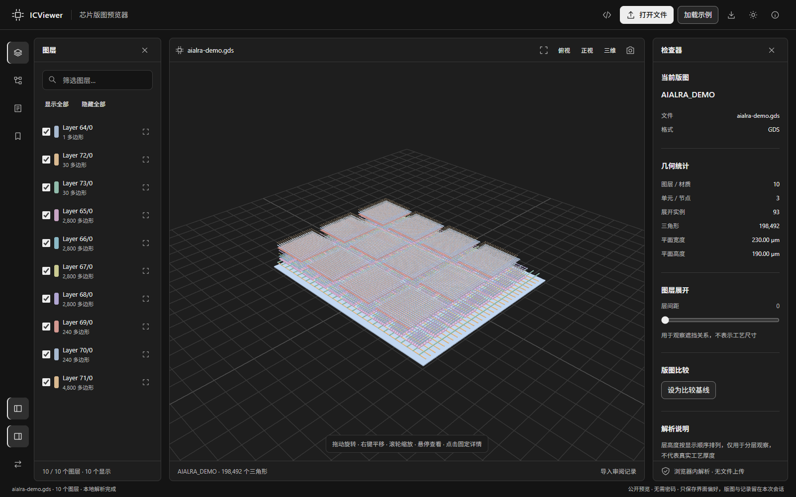
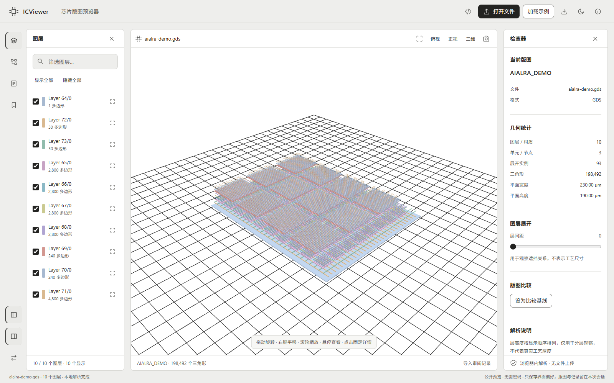
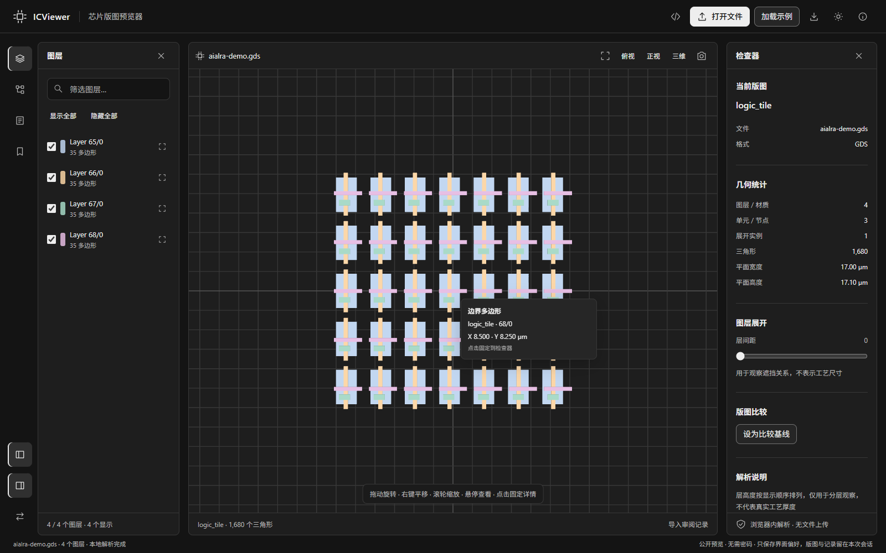
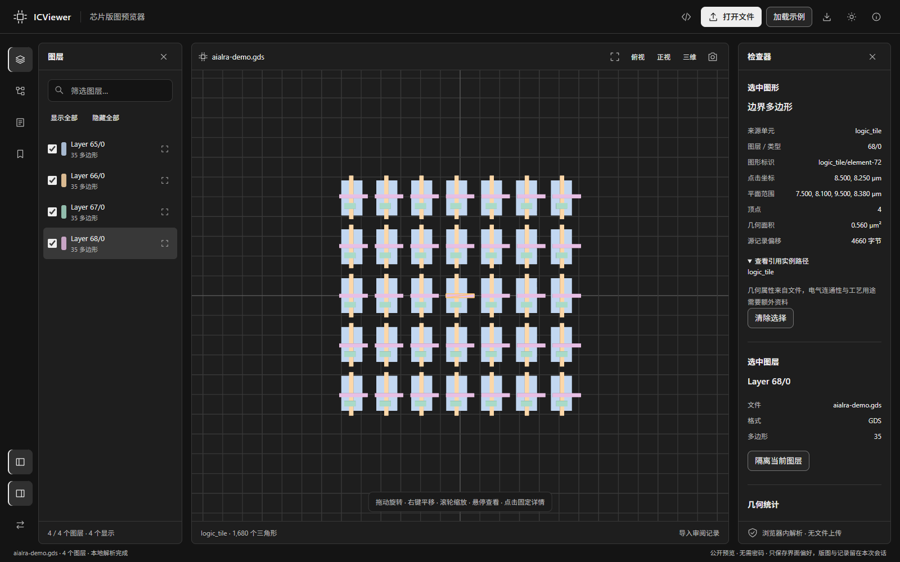
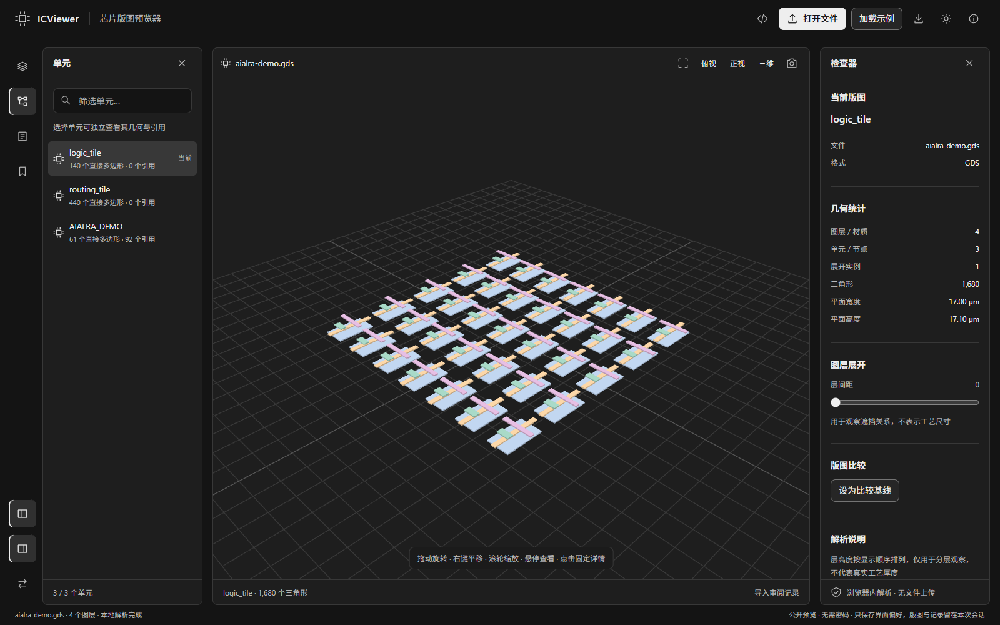
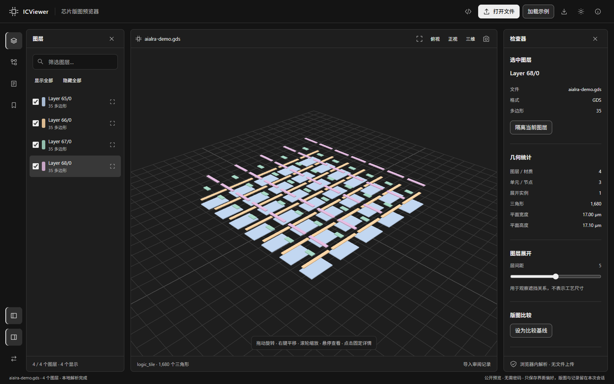
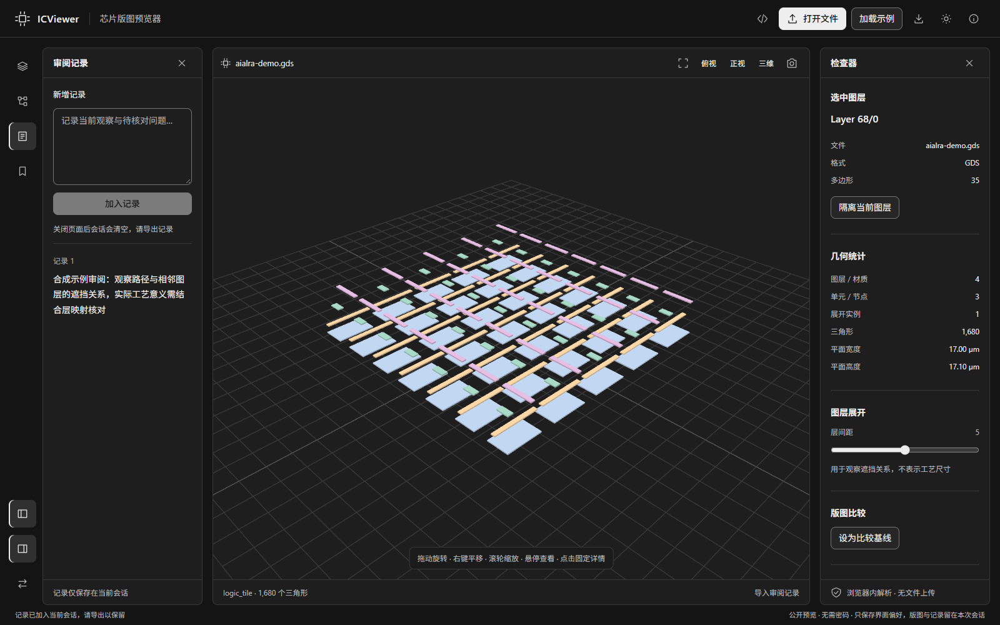
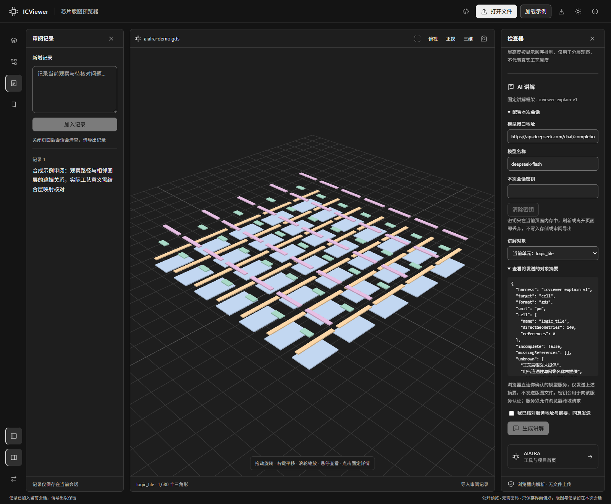
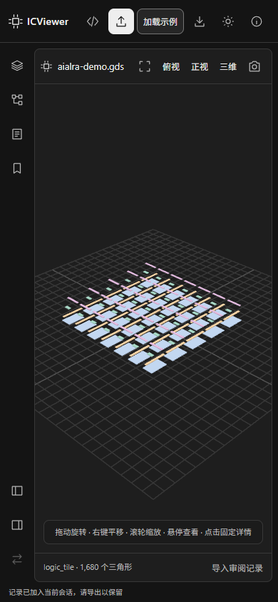

<div align="center">

<h1>ICViewer</h1>

<p><strong>Open chip layouts in your browser and inspect layers, cells and individual geometry</strong></p>

<p>No login · Browser-local files · Hover and click inspection · Optional object explanations</p>

<p>
  <a href="https://icviewer.aialra.online">Open live preview</a> ·
  <a href="https://github.com/AIALRA-0/IC-Viewer">Source code</a> ·
  <a href="https://github.com/AIALRA-0/IC-Viewer/archive/refs/heads/main.zip">Download source</a> ·
  <a href="README.md">简体中文</a>
</p>



Figure 1 The complete workbench running the original synthetic demonstration

</div>

## 1 First successful preview

1. Open the [live preview](https://icviewer.aialra.online) and click “加载示例” to try the synthetic layout
2. Click “打开文件” or drag in a local `.gds`, `.gds2`, `.gdsii`, `.gltf` or `.glb` file; suffix matching is case-insensitive
3. Choose layers or cells, hover for a quick tooltip, and click geometry to pin details in the inspector
4. Adjust views and layer separation, write review notes, and export them for later restoration

Opening files requires no account or model key. Parsing happens in the current browser
After refresh, reopen the source file; review exports contain observations and view state rather than the source layout

## 2 Product showcase

Every image uses the repository's original synthetic sample, without visitor designs or model credentials
The interface follows copied parameters from AIALRA-TEMPLATE; the template itself remains untouched
See [asset provenance](docs/assets/readme/PROVENANCE.md) for dimensions and reproduction

<div align="center">



Figure 2 Light theme preserves the same workspace structure

</div>

<div align="center">



Figure 3 The hover tooltip reports the actual hit cell, layer and coordinates

</div>

<div align="center">



Figure 4 Clicking pins and highlights a primitive with source, dimensions and instance path; PATHs also report width and length

</div>

<div align="center">



Figure 5 Inspect smaller cells independently, including designs exceeding the full expansion budget

</div>

<div align="center">



Figure 6 Separated layers reveal occlusion; display heights are not physical thicknesses

</div>

<div align="center">



Figure 7 Record observations, save camera bookmarks and export restorable reviews

</div>

<div align="center">



Figure 8 Verify the provider and summary before consenting; the key is empty and no real model is called

</div>

<div align="center">



Figure 9 Collapsible panels preserve the preview on a 390 pixel viewport

</div>

## 3 Object explanations and keys

The optional AI panel explains the current cell or clicked geometry using the fixed `icviewer-explain-v1` harness
It requests five sections: known facts, geometry and hierarchy, possible uses, unknowns, and suggested observations
The prompt distinguishes geometric PATHs from electrically identified wires and requires uncertainty when evidence is missing

- Keys live only in current-page memory, use a masked input, and are discarded on refresh, page departure or explicit clearing
- Keys never enter browser storage, review exports or the website server; the browser authenticates directly to the user-selected provider
- Only the confirmed summary is sent; names, instance paths and dimensions can be included, while source files and full vertex arrays are excluded
- The provider must permit browser cross-origin requests; failures appear locally and the website never proxies credentials

AI output and inferred uses need independent review. See [the harness contract](docs/AI-HARNESS.md) for protocol, fields, cancellation and the fixed prompt

## 4 Capabilities and limits

<div align="center">

Table 1 Public preview capabilities and boundaries

| Surface | Current behavior | Boundary |
| --- | --- | --- |
| Layouts | Boundaries, boxes, paths, references, arrays and common transforms | Numeric layers when process metadata is unavailable |
| Missing cells | Existing geometry, incomplete banner and missing-target list | Full rendering needs an export containing dependency cells |
| 3D models | Self-contained, uncompressed static triangle meshes | External resources and images refused; animation not played |
| Hover/selection | Cell, instance, kind, layer, coordinates and dimensions | Does not establish net names or electrical connectivity |
| Layer controls | Visibility, isolation, separation and camera views | Display heights are illustrative |
| Reviews | Notes, bookmarks, camera and layer state export/restore | Retain source files separately |
| Comparison | Layer-count and triangle-count changes | No geometric XOR or manufacturing checks |
| Parsing | 32 MB per file, 45-second limit | Over-budget designs open their cell directory |

</div>

A missing reference is not a suffix error: a file can reference external standard-cell definitions without embedding them
The inspector reports targets and referring cells; missing shapes are never fabricated
See [public preview details](docs/PUBLIC-PREVIEW.md) for exact limits

## 5 Run locally

The public app needs Node.js; CI uses version 22. Run from the repository root:

```sh
# Install from the lockfile
npm ci
# Start the browser-local workbench; the terminal prints its local URL
npm run dev:web
# Check types and build static files
npm run build:web
```

The main entry is [`Workbench.tsx`](apps/web/src/public/Workbench.tsx); deploy only `apps/web/dist`
The original Python-backed workflow is documented in [local development](docs/LOCAL-WORKFLOW.md) and excluded from the public site

## 6 Verification and contributions

The 15 public regressions cover missing cells, transforms/arrays, hover/click facts, key lifetime, direct summaries, cancellation, resource rejection, oversized files, review restoration and mobile layouts
Public and legacy production builds pass. See [verification evidence](docs/VERIFICATION-PUBLIC.md) for scope and release checks

```sh
# Install the real browser used by regression tests
npx playwright install chromium --with-deps
# Run public parser and browser regressions
npm run test:public
# Build the separate original local workflow
npm run build:legacy
```

<div align="center">

Table 2 Source and documentation routes

| Route | Content |
| --- | --- |
| [`apps/web/src/public/`](apps/web/src/public/) | Browser parsing, picking, harness and redesigned UI |
| [`apps/web/tests/public/`](apps/web/tests/public/) | Public parser and real-browser regressions |
| [`scripts/nginx/icviewer-public.conf`](scripts/nginx/icviewer-public.conf) | Dedicated static host and request isolation |
| [Public preview](docs/PUBLIC-PREVIEW.md) | Formats, boundaries and deployment recovery |
| [Explanation harness](docs/AI-HARNESS.md) | Fixed framework and ephemeral key contract |
| [Compatibility specification](docs/COMPATIBILITY_SPEC.md) | Engineering context for the original local API workflow |
| [Issues](https://github.com/AIALRA-0/IC-Viewer/issues) | Reproductions and suggestions using publishable synthetic data |

</div>

This repository maintains the workbench and public preview; [GDS-GLTF-3D-Viewer](https://github.com/AIALRA-0/GDS-GLTF-3D-Viewer) is the related original viewer
Follow [`AGENTS.md`](AGENTS.md) before changing shared contracts

## 7 Publication and rights

Cloudflare proxies the public entry. The origin serves static files only, without an upload API, legacy backend or shared sessions
Normal website requests still reach the site; optional explanations send confirmed summaries to the selected model provider
The viewer is listed on the [AIALRA portal](https://aialra.online), and its separate toolbar source icon opens this repository

No project open-source license has been declared; public visibility alone does not grant unrestricted redistribution
The build retains [third-party notices](apps/web/public-static/NOTICE.txt)
