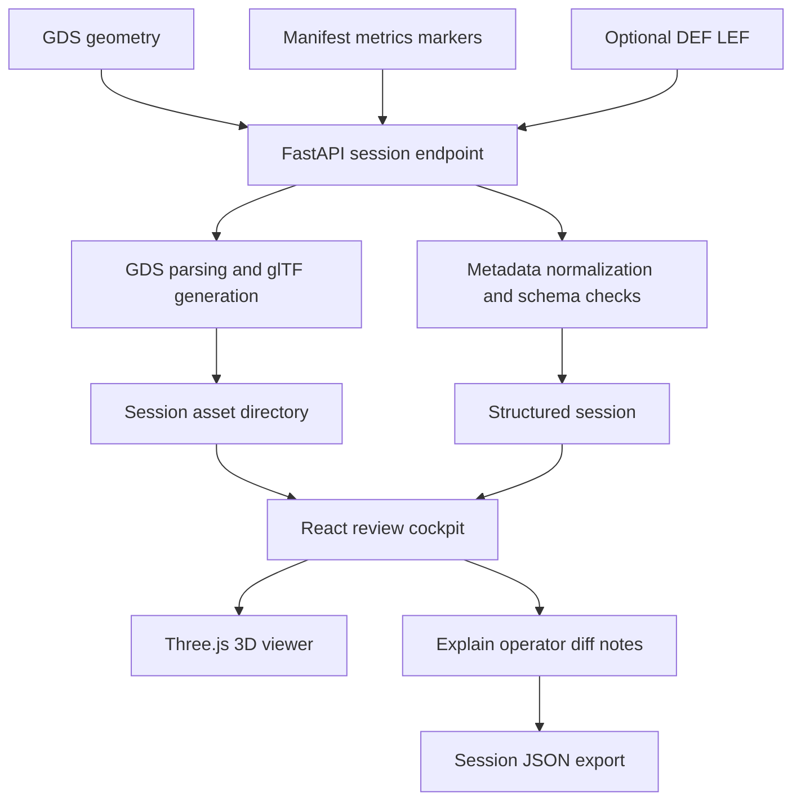

<div align="center">


Figure 1 Project hero banner

<h1>ICViewer</h1>

<p><strong>An explainable 3D integrated-circuit layout review cockpit for education, demos, and early engineering review</strong></p>

<p>
  <a href="README.md">中文</a> ·
  <a href="#quick-start-en">Quick start</a> ·
  <a href="#verification-en">Verification</a> ·
  <a href="docs/COMPATIBILITY_SPEC.md">Compatibility</a> ·
  <a href="docs/DEPLOYMENT.md">Deployment template</a>
</p>

<p>
  <a href="https://github.com/AIALRA-0/IC-Viewer/actions/workflows/ci.yml"></a>
  
  
  
  
</p>

</div>

> [!TIP]
> Public preview deployed on 2026-10-07: [Open ICViewer](https://icviewer.aialra.online)
> The redesigned interface follows AIALRA-TEMPLATE and parses GDS and self-contained glTF/GLB in the browser, with no password or layout-file upload
> [Public usage and deployment](docs/PUBLIC-PREVIEW.md) · [Current verification](docs/VERIFICATION-PUBLIC.md)
> The remaining sections retain the original local backend workflow and its historical verification; that workflow is not connected to the public site

> [!IMPORTANT]
> ICViewer closes the loop from GDS upload and 3D conversion to interaction, engineering metadata, explanation, operator suggestions, diffing, notes, bookmarks, and session export
> The code is a reproducible hackathon, teaching, and early-review prototype without authentication, tenant isolation, or production-grade hostile-file defenses

This status was verified on 2026-08-24 against the source, bundled fixtures, 9 backend tests, 1 real-browser end-to-end test, the production frontend build, and the dependency audit

## 1 Project overview

Many browser GDS viewers stop at geometry rendering
ICViewer places the 3D layout at the center and organizes hierarchy, layers, bounding boxes, polygon statistics, review markers, explanations, and operator actions around a single review workspace

GDS remains the geometry source of truth
Optional `manifest.json`, `metrics.json`, `markers.json`, DEF, and LEF files add technology, metrics, markers, and tool provenance without requiring the browser to understand a proprietary EDA database

<div align="center">

Table 1.1 Project positioning

| Dimension | Current implementation | Evidence |
| --- | --- | --- |
| Product | React, TypeScript, and Three.js browser cockpit | `apps/web/` |
| Backend | FastAPI sessions, conversion, explanation, commands, diff, and export | `apps/api/` |
| Geometry input | GDS file | `fixtures/example/example.gds` |
| Engineering context | Manifest, metrics, markers, DEF, LEF, and technology presets | `packages/shared/`, `fixtures/compat/` |
| AI behavior | DeepSeek-compatible endpoint with deterministic local fallback | `apps/api/app/services/ai_service.py` |
| Current version | `0.1.0` | `package.json`, FastAPI metadata |
| Project phase | Hackathon prototype and reproducible demo | `docs/PROPOSAL.md`, `docs/MILESTONES.md` |

</div>

## 2 Interface preview

The screenshot below comes from a real local frontend and backend run
The browser uploaded the bundled GDS, the backend created a session and generated 3D assets, and the UI displayed the layout, layers, and instance controls

<div align="center">


Figure 2.1 Local end-to-end screenshot

</div>

The screenshot contains only repository fixtures and local UI state, with no deployment domain, account, user identifier, or proprietary chip data

## 3 Architecture

<div align="center">



Figure 3.1 Ingestion, conversion, review, and export flow

</div>

<div align="center">

Table 3.1 Component responsibilities

| Component | Responsibility | Key path |
| --- | --- | --- |
| Web shell | Upload, language, status, drawers, and export | `apps/web/src/App.tsx` |
| 3D viewer | Orbit, pan, zoom, focus, layers, and instance selection | `apps/web/public/reference-viewer/` |
| Session service | Storage, GDS parsing, detail generation, and session reads | `apps/api/app/services/session_service.py` |
| Explanation service | Design summaries and operator suggestions with local fallback | `apps/api/app/services/ai_service.py` |
| Diff service | Structured comparison between two manifests | `apps/api/app/services/diff_service.py` |
| Shared contract | Manifest schema, presets, and frontend types | `packages/shared/` |

</div>

## 4 Delivered capabilities

<div align="center">

Table 4.1 Feature matrix

| Area | Capability | Status |
| --- | --- | --- |
| Input | GDS alone or a bundle with manifest, metrics, markers, DEF, and LEF | Implemented |
| Viewer | Left-drag orbit, right-drag pan, cursor zoom, and double-click focus | Implemented |
| Filtering | Layers, filler cells, top geometry, and instance controls | Implemented |
| Context | Hierarchy, bounding box, cells, instances, polygons, and area | Implemented |
| Review | Markers, notes, bookmarks, and selection state | Implemented |
| Explain | Remote compatible endpoint or deterministic local summary | Implemented |
| Operator | Natural language to constrained viewer actions | Implemented |
| Diff | Compare metrics and markers from two manifests | Implemented |
| Session | Export JSON and re-import through the upload flow | Implemented and tested |
| Performance mode | Simplified rendering for large layouts | Still open in milestones |

</div>

## 5 Compatibility model

ICViewer does not replace the native databases used by OpenROAD, OpenLane, or Virtuoso
It carries geometry through GDS and adds portable engineering context through sidecars

<div align="center">

Table 5.1 Input compatibility

| Source | Required input | Optional input | Boundary |
| --- | --- | --- | --- |
| Generic GDS flow | GDS | Manifest, metrics, markers | Presets or parsed results provide missing layer context |
| OpenROAD or OpenLane | Streamed-out GDS | DEF, LEF, metrics JSON, manifest | Tool-internal databases are not read |
| Virtuoso | Exported or streamed GDS | Technology and layer-name manifest | Native OpenAccess state is out of scope |
| Exported session | Session JSON | None | Restores review state but does not replace GDS archival |

</div>

See [`docs/COMPATIBILITY_SPEC.md`](docs/COMPATIBILITY_SPEC.md) for the input contract
[`packages/shared/manifest.schema.json`](packages/shared/manifest.schema.json) is the field-level source of truth

## 6 API

<div align="center">

Table 6.1 Backend endpoints

| Method | Path | Purpose |
| --- | --- | --- |
| GET | `/health` | Lightweight health check |
| GET | `/api/samples` | List bundled samples |
| GET | `/api/samples/default` | Load the default sample session |
| GET | `/api/samples/{sample_id}` | Load a selected sample session |
| POST | `/api/sessions` | Upload a GDS bundle and create a session |
| GET | `/api/sessions/{session_id}` | Read an existing session |
| POST | `/api/sessions/{session_id}/detail` | Generate detailed assets on demand |
| POST | `/api/explain` | Generate a layout explanation |
| POST | `/api/command` | Generate constrained viewer actions |
| POST | `/api/diff` | Compare two manifests |
| POST | `/api/export` | Export a complete session JSON |

</div>

The API has no authentication or tenant isolation
Bind it to localhost or a protected network rather than exposing it directly as a public multi-user service

## 7 Requirements

<div align="center">

Table 7.1 Verified environments

| Area | Repository constraint or verification environment | Purpose |
| --- | --- | --- |
| Node.js | CI uses 22; local build used 24.13.0 | Dependencies, build, browser tests |
| npm | Local verification used 11.5.2 | Workspace dependency management |
| Python | CI uses 3.11; local tests used 3.12.7 | FastAPI, GDS conversion, tests |
| Browser | Chromium | Playwright end-to-end verification |
| Operating system | Ubuntu in CI; Windows for this audit | Cross-platform development path |

</div>

Python dependencies include `gdstk`, `gdspy`, `triangle`, `pygltflib`, and NumPy
Frontend dependencies include React, Three.js, Vite, TypeScript, and Playwright

<a id="quick-start-en"></a>

## 8 Quick start

### 8.1 Backend

```bash
python3 -m venv .venv # Create an isolated Python environment at the repository root
source .venv/bin/activate # Activate the environment in a POSIX shell
python -m pip install -r apps/api/requirements.txt # Install pinned backend and test dependencies
cd apps/api # Enter the FastAPI application directory
uvicorn app.main:app --reload --host 127.0.0.1 --port 34000 # Start the development API on localhost only
```

On Windows PowerShell, activate the same environment with `.\.venv\Scripts\Activate.ps1`

### 8.2 Frontend

Return to the repository root in a second terminal

```bash
npm ci # Install frontend dependencies from the lock file
npm run dev:web -- --mode legacy --host 127.0.0.1 --port 4173 # Start the original local backend interface
```

Open `http://127.0.0.1:4173/legacy.html`
Select `fixtures/example/example.gds` to reproduce Figure 2.1

### 8.3 Optional explanation endpoint

Without credentials, explain and operator actions use deterministic local rules
Keep any compatible API credential in the local environment rather than the repository, screenshots, or issue reports

```bash
export DEEPSEEK_API_KEY="<your-api-key>" # Inject a local session secret and never commit its real value
export DEEPSEEK_MODEL="<compatible-model>" # Select the compatible model name
export DEEPSEEK_BASE_URL="https://api-provider.example" # Use an operator-authorized compatible endpoint
```

## 9 Interaction guide

<div align="center">

Table 9.1 Common interactions

| Action | Result |
| --- | --- |
| Left drag | Orbit around the target |
| Right drag | Pan the view |
| Mouse wheel | Zoom toward the pointer |
| Double click | Focus selected geometry |
| View | Open the native viewer controls |
| AI | Open explanation and operator panels |
| Data | Inspect metrics, hierarchy, files, and warnings |
| Notes | Add review notes |
| Export | Download the current session JSON |

</div>

<a id="verification-en"></a>

## 10 Verification

<div align="center">

Table 10.1 Local verification on 2026-08-24

| Gate | Command | Result |
| --- | --- | --- |
| Backend tests | `pytest` in `.venv` | 9 passed in 16.89 seconds |
| Frontend build | `npm run build:web` | TypeScript and Vite build passed |
| Browser loop | `npm run test:e2e` | 1 passed in about 1.5 minutes |
| Browser path | Upload fixture, generate detail, open controls, add note, export | Full path passed |
| Dependency audit | `npm audit` | 5 advisories: 3 high and 2 low |

</div>

```bash
.venv/bin/python -m pytest apps/api/tests -q # Run all 9 backend tests from the repository root
npm run build:web # Run TypeScript checks and the production frontend build
npm run test:e2e --workspace @icviewer/web # Run the real-browser loop while both services are available
```

The browser test took about 90 seconds locally while its test-level timeout is 120 seconds
Slower CI runners may time out before the workflow completes, so use the dynamic CI badge at the top as the current remote result

## 11 Repository map

<div align="center">

Table 11.1 Directory structure

| Path | Content |
| --- | --- |
| `apps/api/` | FastAPI app, services, schemas, and 9 tests |
| `apps/web/` | React cockpit, native viewer shell, and Playwright test |
| `packages/shared/` | Manifest schema, TypeScript types, and technology presets |
| `fixtures/example/` | Bundled GDS and example manifest |
| `fixtures/compat/` | OpenROAD-style DEF, LEF, metrics, markers, and manifest |
| `scripts/` | Smoke, build, and configurable deployment templates |
| `docs/` | Proposal, milestones, tests, compatibility, deployment, and coordination |
| `.github/workflows/ci.yml` | Frontend build, backend tests, and browser test |
| `AGENTS.md` | Shared-path locking and cross-owner coordination rules |

</div>

## 12 Privacy and security

- Historical production domains, deployment roots, and internal repository paths have been replaced with neutral examples
- Uploaded content and generated assets go to ignored `apps/api/data/`
- Before sharing screenshots, exported sessions, or logs, verify that the chip data is authorized for publication
- Inject credentials only through environment variables and keep them out of manifests, session JSON, screenshots, and logs
- The current FastAPI CORS policy allows every origin and should be restricted for production
- There is no login, authorization, or tenant isolation for mutually untrusted users
- The example systemd unit uses `User=root`; production operators should switch to a restricted service account and update ownership
- Nginx, certificates, and deployment scripts are templates that require operator-specific values and an independent security review

## 13 Known limitations

- The conversion path is verified against bundled GDS fixtures rather than every process and generator
- Detailed assets can be deferred for large layouts, but performance mode and simplified rendering remain open
- AI explanations are supporting information, not a substitute for DRC, timing signoff, or tapeout review
- Local-rule fallback keeps the demo available but is not a remote-model response
- The historical 2026-08-24 audit reported 3 high and 2 low frontend-toolchain advisories; compatible upgrades now report 0, and builds plus public browser regression pass; see the current verification record
- The browser test is close to its current timeout and may vary with runner performance
- The repository declares no open-source license

## 14 Contributing

- First, acquire the shared-path lock in `docs/agent-locks.md`

- Second, record frontend and backend contract changes according to `AGENTS.md`

- Third, add a failing test using a bundled or synthetic layout

- Fourth, run backend tests, the frontend build, and the browser loop

- Fifth, update both READMEs, compatibility notes, milestones, and the changelog

- Sixth, scan for domains, accounts, credentials, internal paths, and chip-design identity data

## 15 License

The repository has no `LICENSE` file and declares no open-source license
Default copyright rules apply until the rights holder adds one, and public visibility does not grant permission to copy, modify, or redistribute the project
