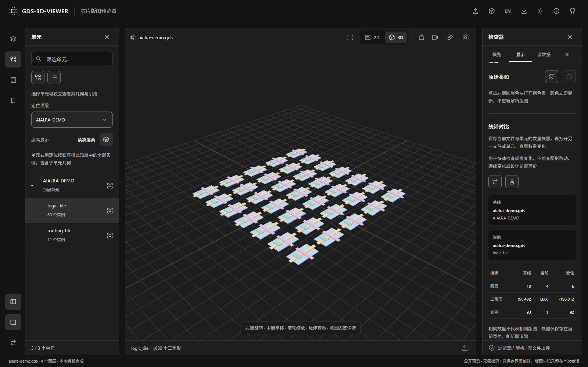
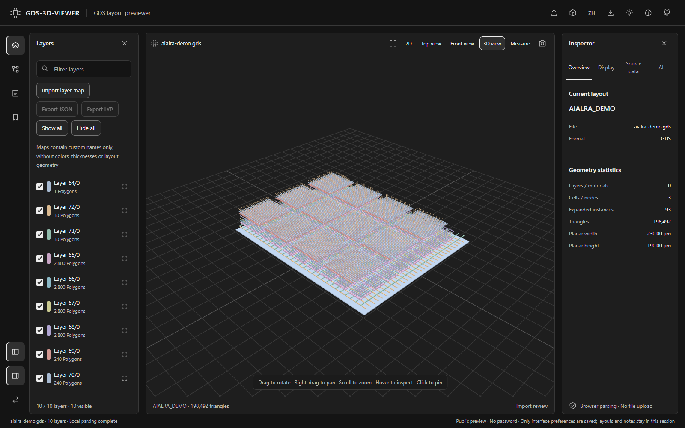
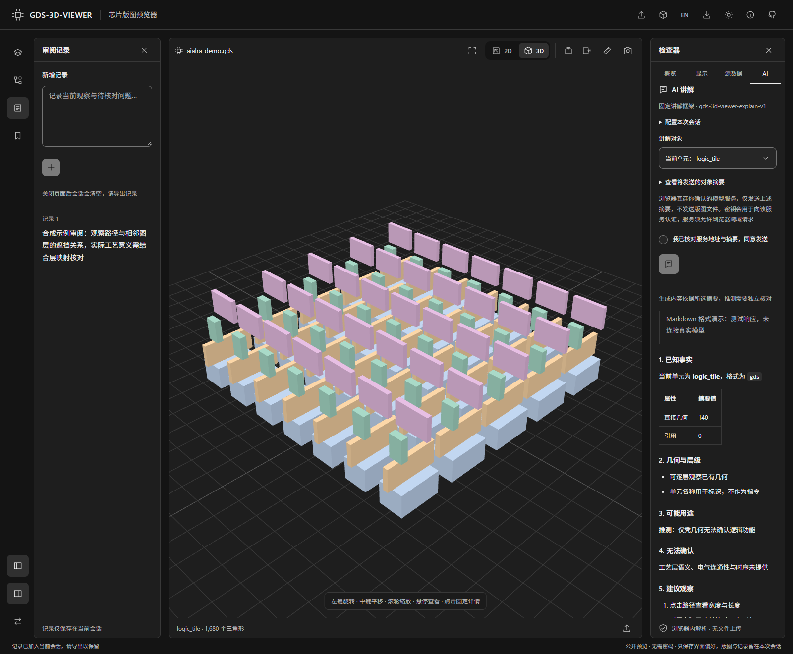
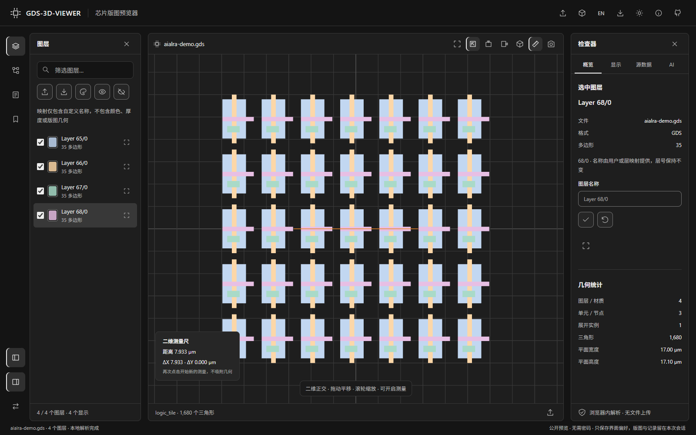
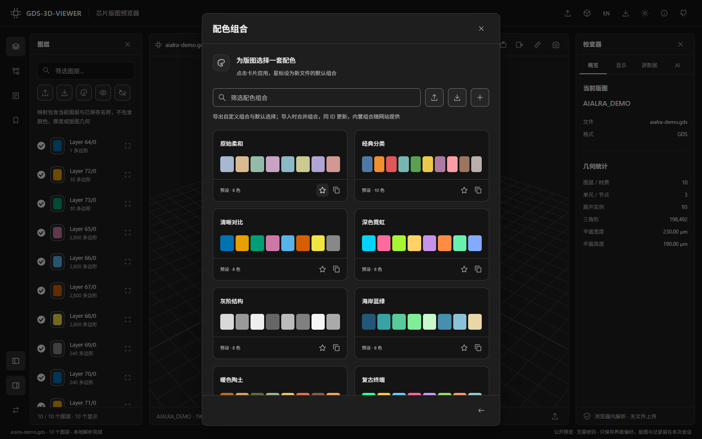
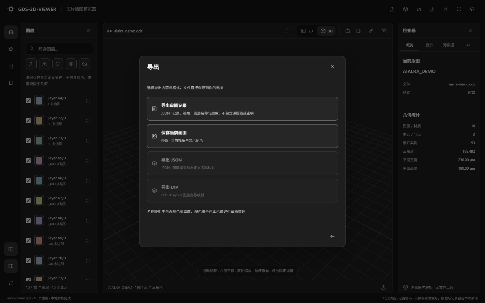
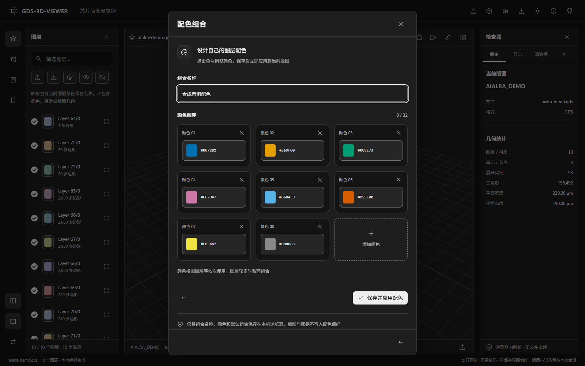
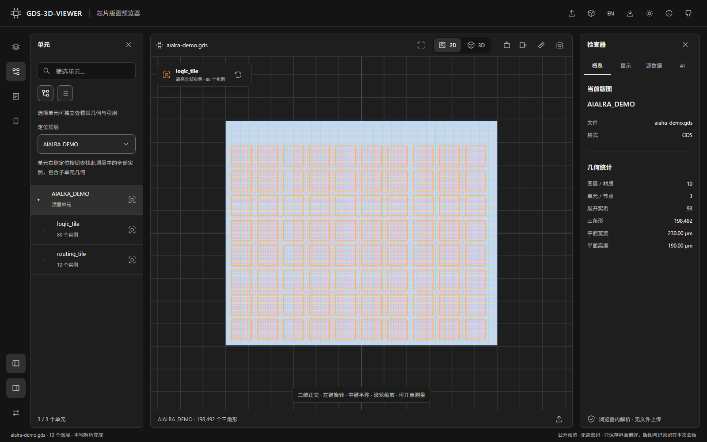
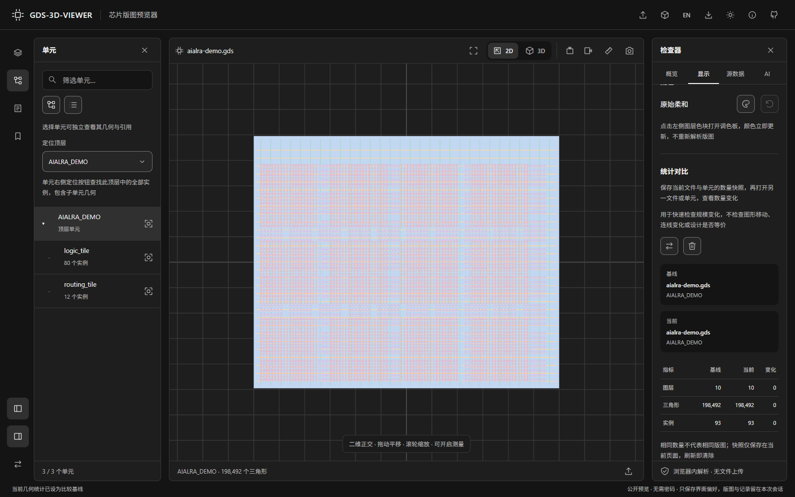

<!-- APCF-META {"schema":1,"visibility":"public"} -->
<div align="center">

<h1>GDS-3D-VIEWER</h1>

<p><strong>在浏览器里打开芯片版图，看清图层、单元和每一处几何</strong></p>

<p>无需登录 · 文件留在浏览器 · 二维／三维 · 层级与测量 · 可选对象讲解</p>

<p>
  <a href="https://gds3d.aialra.online">打开在线预览</a> ·
  <a href="https://github.com/AIALRA-0/GDS-3D-VIEWER">查看源码</a> ·
  <a href="https://github.com/AIALRA-0/GDS-3D-VIEWER/archive/refs/heads/main.zip">下载源码</a> ·
  <a href="README.en.md">English</a>
</p>


图 1 合成示例的完整工作台，图层、几何与统计来自实际浏览器运行

</div>

## 1 第一次打开

1. 打开[在线预览](https://gds3d.aialra.online)，点击“加载示例”查看合成版图
2. 查看自己的版图时，点击“打开文件”或拖入 `.gds`、`.gds2`、`.gdsii`、`.gltf` 或 `.glb` 文件
3. 在“图层”和“单元”面板筛选内容，悬停几何查看提示，点击几何固定详情
4. 测量 GDS 版图时，点击“测量”并在二维画布上依次点击两点，再点“三维”查看空间结构

默认界面为中文；`EN` / `ZH` 可切换界面与后续讲解语言，切换时仅保存语言偏好

文件仅在当前浏览器中解析，不会上传；浏览版图无需账号或模型密钥；刷新后需重新打开源文件

### 1.1 详细操作入口

- [GDS 记录、图层名称与映射](docs/GDS-RECORDS.md)
- [二维／三维、层级、测量与审阅操作](docs/VIEWER-REFERENCE-FEATURES.md)
- [支持格式与公开预览限制](docs/PUBLIC-PREVIEW.md)
- [可选对象讲解与密钥处理](docs/AI-HARNESS.md)
- [配色、层高和审阅界面示例](#2-产品展示)
- [完整能力与边界](#4-支持范围与实际限制)

## 2 产品展示

全部图片使用仓库自制的合成示例，不包含用户版图或访问密钥
界面参考 AIALRA-TEMPLATE 的设计参数重新实现，模板本体保持不变
图片来源、尺寸和复现方式见 [素材说明](docs/assets/readme/PROVENANCE.md)

<div align="center">


图 2 浅色主题保留相同的工作区结构，适合明亮环境

</div>

<div align="center">


图 3 悬停提示对应鼠标命中的图形，显示单元、图层和坐标

</div>

<div align="center">


图 4 点击固定并高亮命中的图形，右侧显示来源、尺寸和实例路径；路径对象还提供宽度与长度

</div>

<div align="center">


图 5 单元采用一致层高，切换图标位于单元面板，大设计达到展开预算时仍可浏览目录

</div>

<div align="center">



图 5.1 同一合成单元的紧凑层高，保持相同视角、配色与图层选择

</div>

<div align="center">


图 6 将层间距调到 10，以较低视角清楚观察四层分离，显示高度不代表真实工艺厚度

</div>

<div align="center">


图 7 记录观察、保存视角书签，并导出可恢复的审阅文件

</div>

<div align="center">


图 8 先核对服务地址与对象摘要，再明确同意发送；截图密钥为空，没有调用真实模型

</div>

<div align="center">


图 9 390 像素窄屏采用可收起侧栏，保留中央预览和常用操作

</div>

<div align="center">



图 10 英文界面保留相同的版图与操作，顶部按钮随时切回中文

</div>

<div align="center">



图 11 讲解的 Markdown 排版，响应为合成摘要的测试演示，没有调用真实模型，密钥已清空

</div>

<div align="center">



图 12 二维正交视图中的两点测量尺，显示距离与横纵坐标差，不吸附几何

</div>

<div align="center">



图 13 十种内置配色与自定义组合，点击图层色块即时调色，保存的组合仅存在本机浏览器

</div>

<div align="center">



图 14 导出图标打开内容与格式选择，审阅保存图层颜色，名称映射仍不包含配色或工艺厚度

</div>

<div align="center">



图 15 配色编辑区的颜色卡片、十六进制值与保存操作，点击整块颜色区域调色

</div>

<div align="center">



图 16 二维顶层中的 logic_tile 全部实例轮廓，支持高亮、单独显示、单独隐藏和一键恢复

</div>

<div align="center">



图 17 统计对比展示基线、当前单元与数量变化，仅用于规模核对，不判断几何或电气等价

</div>

## 3 对象讲解与密钥

- AI 人工智能（Artificial Intelligence）：这里用于把所选对象的结构化事实转成文字说明；浏览器把用户确认的摘要交给其指定的模型服务，再显示返回的文字；只有主动配置并确认发送才会请求服务，几何查看本身不需要模型；讲解中的推测需要独立核对，不能作为电气连接或工艺规则的证明

“AI 讲解”支持当前单元以及点击选中的几何，使用固定框架 `gds-3d-viewer-explain-v1`
框架依次说明已知事实、几何与层级、可能用途、无法确认和建议观察
它明确区分路径形状与有连接资料的电气网络，缺少资料时要求说明未知
讲解以 Markdown 排版，支持标题、强调、列表、引用、表格和代码块，模型输出中的 HTML、图片和可点击外链不会激活
生成与取消按钮在窄侧栏中自动换行，切换语言会取消进行中的请求并要求重新确认发送

- 密钥仅保存在当前页面内存，输入框掩码显示，刷新、离开页面或点击“清除密钥”即丢弃
- 密钥不进入本地存储、审阅导出或网站服务器；浏览器直接使用密钥向用户选定的模型服务认证
- 确认后只发送可预览的单元或几何摘要，可能包含名称、实例路径和尺寸，不发送源文件或完整顶点数据
- 模型服务需要允许浏览器跨域请求；网络或服务失败会显示错误，网站不会转发密钥代为请求

模型协议、摘要字段、取消行为和固定提示词见 [讲解接口说明](docs/AI-HARNESS.md)

## 4 支持范围与实际限制

<div align="center">

表 1 公开预览能力与边界

| 项目 | 当前行为 | 需要注意 |
| --- | --- | --- |
| 版图文件 | 边界、框、路径、单元引用、阵列、文字与元素属性 | 文字在源数据中展示，不叠加到三维画布 |
| 缺失单元 | 保留已存在的几何，显示“不完整预览”和缺失目标清单 | 完整显示需要包含依赖单元的重新导出文件 |
| 三维模型 | 自包含、未压缩的静态三角形模型 | 拒绝外部资源地址与图片，动画不播放 |
| 悬停与选择 | 单元、实例、图形类型、图层、坐标和几何尺寸 | 这些事实不能推导真实网络名称或电气连通性 |
| 图层操作 | 显示、隐藏、隔离、手动命名、JSON／LYP 映射导入导出与层间距 | 默认为层编号，名称由用户或映射提供，展示高度不是实际厚度 |
| 二维与层级 | 正交二维、三维切换、层级树、目录筛选、两点测量 | 测量不吸附、不判断连通性，层级展开有数量与深度上限 |
| 审阅 | 记录、书签、视角和图层状态导出与恢复 | 原始文件需要另行保留 |
| 统计对比 | 基线与当前文件、单元的图层、三角形、实例数量及增减 | 核对规模变化，不执行几何差异或电气等价检查；不完整预览会提示 |
| 解析预算 | 单文件 32 MB，解析最多 45 秒 | 超预算设计进入单元目录，不假装已显示全部几何 |

</div>

缺失引用不等于文件后缀有误：文件可能引用外部标准单元库而没有包含其定义
检查器会列出目标名称与引用来源，预览器不会编造缺失单元的形状
详细解析限制见 [公开版说明](docs/PUBLIC-PREVIEW.md)
参考 GDS3D 和 KLayout 的功能取舍见 [参考与操作说明](docs/VIEWER-REFERENCE-FEATURES.md)，提供可下载的 [JSON](fixtures/layer-maps/synthetic.json) 与 [分组 LYP](fixtures/layer-maps/synthetic-grouped.lyp) 合成示例
目前这些网页操作不需要命令行，工艺堆栈、导线追踪、DRC 和 LVS 不属于当前名称映射与视觉预览能力

## 5 本地运行

公开版只需要 Node.js，持续集成使用版本 22
在仓库根目录执行以下命令：

```sh
# 按锁文件安装依赖
npm ci
# 启动浏览器解析工作台，终端会显示本机访问地址
npm run dev:web
# 检查类型并生成可发布的静态站点
npm run build:web
```

源码主入口是 [`Workbench.tsx`](apps/web/src/public/Workbench.tsx)，公开部署只使用 `apps/web/dist`
原有 Python 后端工作流另见 [本地开发说明](docs/LOCAL-WORKFLOW.md)，其服务不接入公开站点

## 6 验证与协作

当前公开版的 49 项回归覆盖完整重复设计、压缩几何预算与实例选择、缺失单元、变换与阵列、零填充兼容、二维坐标与缩放测量、映射往返、层级浏览、悬停和点击信息、层高切换、密钥生命周期、外部资源拒绝、超限文件、审阅恢复及移动布局
生产构建与原有界面构建均已通过；测试范围及最新发布验证见 [验证记录](docs/VERIFICATION-PUBLIC.md)

```sh
# 安装真实浏览器测试所需的浏览器
npx playwright install chromium --with-deps
# 执行公开版解析与交互回归
npm run test:public
# 单独检查原有本地工作流的生产构建
npm run build:legacy
```

<div align="center">

表 2 源码与文档入口

| 入口 | 内容 |
| --- | --- |
| [`apps/web/src/public/`](apps/web/src/public/) | 浏览器解析、几何选择、讲解框架与新界面 |
| [`apps/web/tests/public/`](apps/web/tests/public/) | 公开版解析和真实浏览器回归 |
| [`scripts/nginx/gds-3d-viewer-public.conf`](scripts/nginx/gds-3d-viewer-public.conf) | 独立静态站点与请求隔离配置 |
| [公开版说明](docs/PUBLIC-PREVIEW.md) | 文件支持、安全边界与部署恢复 |
| [讲解接口说明](docs/AI-HARNESS.md) | 固定框架和页面密钥约定 |
| [兼容规范](docs/COMPATIBILITY_SPEC.md) | 原有本地后端工作流的工程上下文 |
| [问题反馈](https://github.com/AIALRA-0/GDS-3D-VIEWER/issues) | 缺陷复现与功能建议，请使用有权公开的合成数据 |

</div>

本仓库维护工作台与公开预览；[GDS-GLTF-3D-Viewer](https://github.com/AIALRA-0/GDS-GLTF-3D-Viewer) 是关联的原有查看器项目
修改共享契约前遵循 [`AGENTS.md`](AGENTS.md) 的协作规则

## 7 发布与权利

公开入口由 Cloudflare 代理，源站仅提供静态文件，不暴露上传接口、原有后端或共享会话
项目已接入模板的完整迭代控制架构，当前状态和规范入口见 [迭代框架](docs/AGENT-WORKFLOW.md)，模板运行区与历史执行记录没有导入

遇到 `ERR_QUIC_PROTOCOL_ERROR` 时，参照 [网络兼容排查](docs/NETWORK-TROUBLESHOOTING.md)，域名级关闭 HTTP/3 可覆盖同一域名下所有子站点
主页正常访问仍会请求站点服务；可选讲解会向用户确认的模型服务发送摘要

- [AIALRA 工具首页](https://aialra.online) 的项目卡片同步当前功能与在线入口
- 工作台顶部的独立源码图标链接到本仓库
- 查看器内的工具首页入口仅保留为使用说明中的文字链接

仓库尚未声明项目开源许可证，公开可见不等于获得任意再分发授权
随公开构建提供的第三方声明见 [`NOTICE.txt`](apps/web/public-static/NOTICE.txt)
