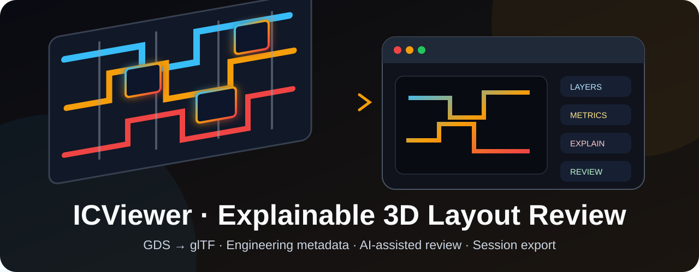
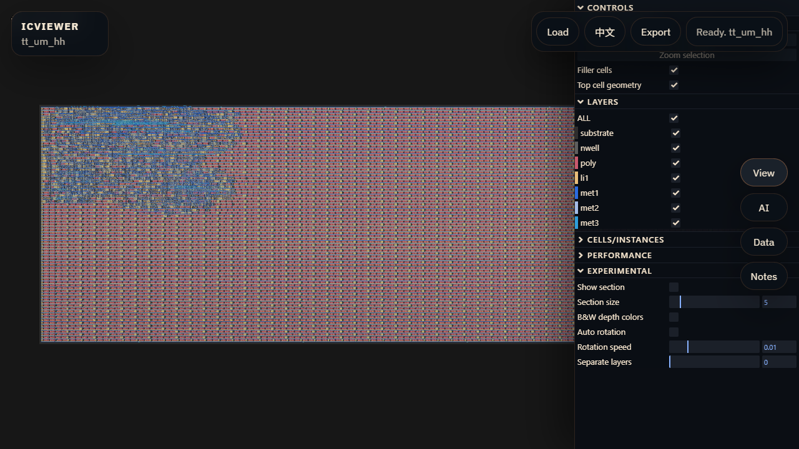
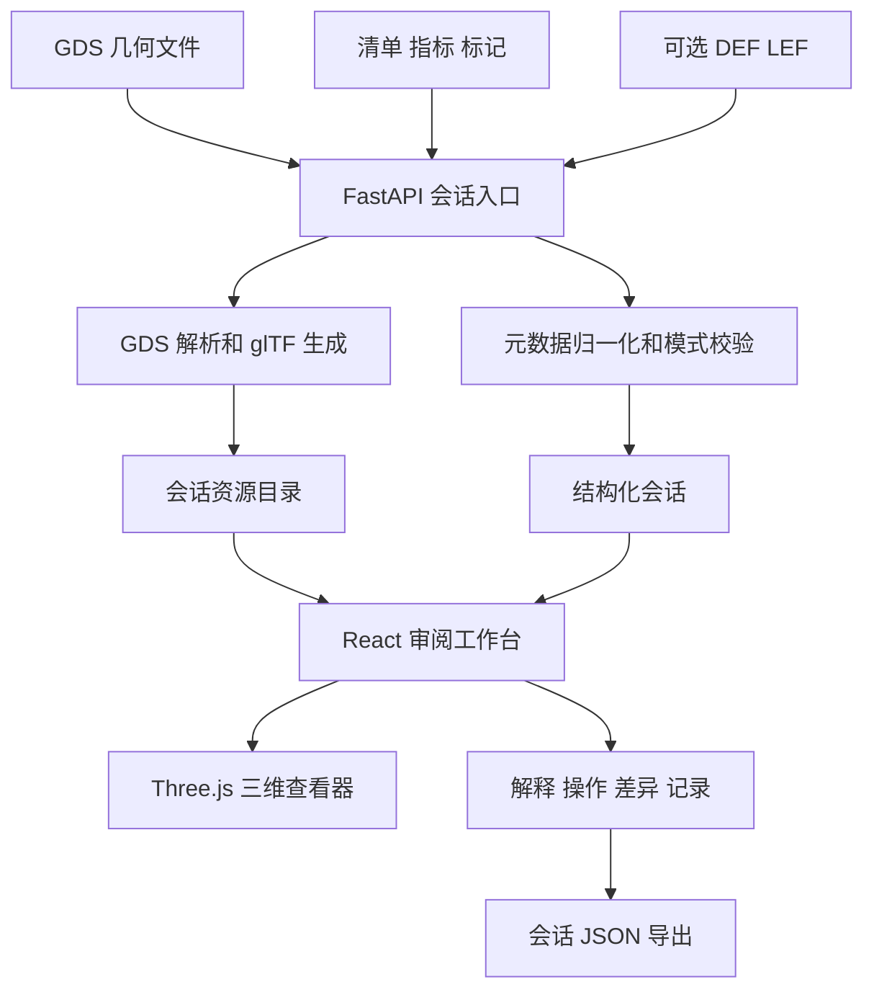

<div align="center">



图 1 项目入口横幅

<h1>ICViewer</h1>

<p><strong>面向芯片版图教学、演示和早期评审的可解释三维集成电路审阅工作台</strong></p>

<p>
  <a href="README.en.md">English</a> ·
  <a href="#quick-start-cn">快速开始</a> ·
  <a href="#verification-cn">验证证据</a> ·
  <a href="docs/COMPATIBILITY_SPEC.md">兼容规范</a> ·
  <a href="docs/DEPLOYMENT.md">部署模板</a>
</p>

<p>
  <a href="https://github.com/AIALRA-0/IC-Viewer/actions/workflows/ci.yml"></a>
  
  
  
  
</p>

</div>

> [!IMPORTANT]
> ICViewer 已完成 GDS 上传、三维转换、版图交互、工程元数据、解释、操作建议、差异比较、记录、书签和会话导出闭环
> 当前代码面向黑客松演示、教学和早期评审，尚未具备身份认证、多租户隔离和生产级恶意文件防护

本文全部数值来自 2026-08-24 对源代码、固定样例、后端测试、真实浏览器端到端测试、前端生产构建和依赖审计的复核记录

## 1 项目概览

传统网页 GDS 查看器通常停留在几何渲染
ICViewer 把三维版图放在中央工作区，并把层级、层信息、边界框、多边形统计、评审标记、解释结果和操作建议组织在同一个审阅界面中

GDS 是几何事实源
`manifest.json`、`metrics.json`、`markers.json`、DEF 和 LEF 作为可选旁路文件补充工艺、指标、标记和工具来源，不要求浏览器理解商业电子设计自动化数据库

<div align="center">

表 1.1 项目定位

| 维度 | 当前实现 | 证据 |
| --- | --- | --- |
| 产品形态 | React、TypeScript 和 Three.js 浏览器工作台 | `apps/web/` |
| 后端 | FastAPI 会话、转换、解释、命令、差异和导出接口 | `apps/api/` |
| 几何输入 | GDS 文件 | `fixtures/example/example.gds` |
| 工程上下文 | 清单、指标、标记、DEF、LEF 和工艺预设 | `packages/shared/`、`fixtures/compat/` |
| 人工智能 | DeepSeek 兼容接口，可在无密钥时使用确定性本地规则 | `apps/api/app/services/ai_service.py` |
| 当前版本 | `0.1.0` | `package.json`、FastAPI 应用元数据 |
| 项目阶段 | 黑客松原型和可复现演示 | `docs/PROPOSAL.md`、`docs/MILESTONES.md` |

</div>

## 2 界面预览

下图来自本地运行的真实前后端
浏览器上传仓库固定 GDS 后，后端完成会话创建和三维资源生成，界面显示版图、层开关和单元层级控制

<div align="center">



图 2.1 本地端到端运行截图

</div>

截图只包含仓库固定样例和本地界面，不包含部署域名、账号、用户标识或真实芯片设计

## 3 系统结构

<div align="center">



图 3.1 数据进入、转换、审阅和导出流程

</div>

<div align="center">

表 3.1 组件职责

| 组件 | 职责 | 关键路径 |
| --- | --- | --- |
| 网页外壳 | 上传、语言切换、状态、抽屉和导出 | `apps/web/src/App.tsx` |
| 三维查看器 | 轨道旋转、平移、缩放、聚焦、分层和单元选择 | `apps/web/public/reference-viewer/` |
| 会话服务 | 文件保存、GDS 解析、详细资源生成和会话读取 | `apps/api/app/services/session_service.py` |
| 解释服务 | 设计摘要和自然语言操作建议，本地规则可回退 | `apps/api/app/services/ai_service.py` |
| 差异服务 | 比较两份清单并生成结构化差异 | `apps/api/app/services/diff_service.py` |
| 共享契约 | 清单模式、预设和前端类型 | `packages/shared/` |

</div>

## 4 已交付能力

<div align="center">

表 4.1 功能矩阵

| 范围 | 能力 | 当前状态 |
| --- | --- | --- |
| 输入 | 单独 GDS 或带清单、指标、标记、DEF 和 LEF 的文件组 | 已实现 |
| 查看 | 左键旋转、右键平移、滚轮指针缩放、双击聚焦 | 已实现 |
| 筛选 | 图层开关、填充单元、顶层几何和实例控制 | 已实现 |
| 上下文 | 层级、边界框、单元数、实例数、多边形数和面积 | 已实现 |
| 评审 | 标记、记录、书签和选择状态 | 已实现 |
| 解释 | 远程兼容接口或确定性本地摘要 | 已实现 |
| 操作器 | 把自然语言请求转换为受限查看器动作 | 已实现 |
| 差异 | 比较两份版图清单的指标和标记 | 已实现 |
| 会话 | 导出会话 JSON，并通过上传流程重新载入 | 已实现并有测试 |
| 性能模式 | 简化大型版图渲染 | 里程碑仍标记为待完成 |

</div>

## 5 兼容模型

ICViewer 不尝试替代 OpenROAD、OpenLane 或 Virtuoso 的原生数据库
它使用 GDS 承载几何，再用旁路文件承载能够公开交换的工程上下文

<div align="center">

表 5.1 输入兼容性

| 来源 | 必需输入 | 可选输入 | 边界 |
| --- | --- | --- | --- |
| 通用 GDS 流程 | GDS | 清单、指标和标记 | 未提供工艺映射时使用预设或解析结果 |
| OpenROAD 或 OpenLane | 流片输出 GDS | DEF、LEF、指标 JSON 和清单 | 不读取工具内部数据库 |
| Virtuoso | 导出或流片 GDS | 描述工艺和层名称的清单 | OpenAccess 原生状态不在当前范围 |
| 已导出会话 | 会话 JSON | 无 | 用于恢复审阅状态，不替代原始 GDS 归档 |

</div>

更完整的输入约定见 [`docs/COMPATIBILITY_SPEC.md`](docs/COMPATIBILITY_SPEC.md)
清单字段以 [`packages/shared/manifest.schema.json`](packages/shared/manifest.schema.json) 为准

## 6 接口

<div align="center">

表 6.1 后端接口

| 方法 | 路径 | 用途 |
| --- | --- | --- |
| GET | `/health` | 轻量健康检查 |
| GET | `/api/samples` | 列出内置样例 |
| GET | `/api/samples/default` | 取得默认样例会话 |
| GET | `/api/samples/{sample_id}` | 取得指定样例会话 |
| POST | `/api/sessions` | 上传 GDS 文件组并创建会话 |
| GET | `/api/sessions/{session_id}` | 读取已创建会话 |
| POST | `/api/sessions/{session_id}/detail` | 按需生成大型版图详细资源 |
| POST | `/api/explain` | 生成设计解释 |
| POST | `/api/command` | 生成受限查看器动作 |
| POST | `/api/diff` | 比较两份清单 |
| POST | `/api/export` | 导出完整会话 JSON |

</div>

当前接口没有身份认证和租户隔离
只应绑定到本机或受保护网络，不能直接暴露为公开多用户服务

## 7 环境要求

<div align="center">

表 7.1 已验证环境

| 范围 | 仓库约束或本次环境 | 用途 |
| --- | --- | --- |
| Node.js | CI 使用 22，本次本地构建使用 24.13.0 | 前端依赖、构建和浏览器测试 |
| npm | 本次使用 11.5.2 | 工作区依赖管理 |
| Python | CI 使用 3.11，本次本地测试使用 3.12.7 | FastAPI、GDS 转换和测试 |
| 浏览器 | Chromium | Playwright 端到端验证 |
| 操作系统 | CI 为 Ubuntu，本次复核为 Windows | 项目具有跨平台开发路径 |

</div>

Python 依赖包含 `gdstk`、`gdspy`、`triangle`、`pygltflib` 和 NumPy
前端依赖包含 React、Three.js、Vite、TypeScript 和 Playwright

<a id="quick-start-cn"></a>

## 8 快速开始

### 8.1 后端

```bash
python3 -m venv .venv # 在仓库根目录创建隔离的 Python 环境
source .venv/bin/activate # 在 POSIX 终端激活环境
python -m pip install -r apps/api/requirements.txt # 安装锁定版本的后端和测试依赖
cd apps/api # 进入 FastAPI 应用目录
uvicorn app.main:app --reload --host 127.0.0.1 --port 34000 # 仅在本机启动开发接口
```

Windows PowerShell 使用 `.\.venv\Scripts\Activate.ps1` 激活同一环境

### 8.2 前端

在另一个终端回到仓库根目录

```bash
npm ci # 按锁文件安装前端依赖
npm run dev:web -- --host 127.0.0.1 --port 4173 # 启动本机 Vite 开发服务器
```

浏览器访问 `http://127.0.0.1:4173`
选择 `fixtures/example/example.gds` 可以复现图 2.1

### 8.3 可选解释接口

没有密钥时，解释和操作器会使用确定性本地规则
接入兼容接口时只在本机环境中设置密钥，不要写入仓库、终端截图或问题报告

```bash
export DEEPSEEK_API_KEY="<your-api-key>" # 注入本机会话密钥，禁止提交真实值
export DEEPSEEK_MODEL="<compatible-model>" # 指定兼容模型名称
export DEEPSEEK_BASE_URL="https://api-provider.example" # 使用运营者授权的兼容接口地址
```

## 9 操作要点

<div align="center">

表 9.1 常用交互

| 操作 | 结果 |
| --- | --- |
| 左键拖动 | 围绕当前目标旋转 |
| 右键拖动 | 平移视图 |
| 滚轮 | 以指针位置为中心缩放 |
| 双击几何 | 聚焦选中对象 |
| View | 打开原生查看器控制面板 |
| AI | 打开解释和操作器面板 |
| Data | 查看指标、层级、文件和警告 |
| Notes | 添加评审记录 |
| Export | 下载当前会话 JSON |

</div>

## 10 验证证据

<a id="verification-cn"></a>

<div align="center">

表 10.1 2026-08-24 本地复核结果

| 门禁 | 命令 | 结果 |
| --- | --- | --- |
| 后端测试 | `.venv` 中运行 `pytest` | 9 项通过，耗时 16.89 秒 |
| 前端构建 | `npm run build:web` | TypeScript 和 Vite 构建通过 |
| 浏览器闭环 | `npm run test:e2e` | 1 项通过，耗时约 1.5 分钟 |
| 浏览器路径 | 上传固定 GDS、生成详细资源、打开控制、记录、导出 | 全流程通过 |
| 依赖审计 | `npm audit` | 5 项告警，其中 3 项高危、2 项低危 |

</div>

```bash
.venv/bin/python -m pytest apps/api/tests -q # 从仓库根目录运行 9 项后端测试
npm run build:web # 执行 TypeScript 检查和前端生产构建
npm run test:e2e --workspace @icviewer/web # 在前后端运行时执行真实浏览器闭环
```

浏览器测试在当前机器耗时约 90 秒，而测试文件的超时上限是 120 秒
较慢的持续集成运行器可能在功能完成前触发超时，动态状态以页面顶部的 CI 徽章为准

## 11 仓库导航

<div align="center">

表 11.1 目录结构

| 路径 | 内容 |
| --- | --- |
| `apps/api/` | FastAPI 应用、服务、模式和 9 项测试 |
| `apps/web/` | React 工作台、原生查看器外壳和 Playwright 测试 |
| `packages/shared/` | 清单模式、TypeScript 类型和工艺预设 |
| `fixtures/example/` | 固定 GDS 和示例清单 |
| `fixtures/compat/` | OpenROAD 风格 DEF、LEF、指标、标记和清单 |
| `scripts/` | 冒烟、构建和可配置部署模板 |
| `docs/` | 提案、里程碑、测试、兼容、部署和协作记录 |
| `.github/workflows/ci.yml` | 前端构建、后端测试和浏览器测试 |
| `AGENTS.md` | 共享路径锁和跨角色协作规则 |

</div>

## 12 隐私安全边界

- 仓库已经把历史生产域名、部署根目录和内部仓库路径替换为中性示例
- 上传内容和生成资源写入 `apps/api/data/`，该目录已被 Git 忽略
- 对外分享的截图、导出会话和日志只能包含有权公开的芯片数据
- 密钥只通过环境变量注入，不应进入清单、会话 JSON、截图或日志
- 当前 FastAPI 跨域配置允许所有来源，生产部署需要收紧到明确来源
- 当前系统没有登录、权限和多租户隔离，不能承载互不信任的公开用户
- 示例 systemd 单元使用 `User=root`，生产运营者需要改为受限服务账号并重新设置文件权限
- Nginx、证书和部署脚本是模板，必须替换示例域名并经过独立安全审核

## 13 已知边界

- 当前转换管线验证了仓库固定 GDS，不代表兼容所有工艺和所有 GDS 生成器
- 大型版图可以延迟生成详细资源，但性能模式和简化渲染仍在待办列表
- 人工智能解释是辅助信息，不能代替版图规则检查、时序签核或流片审查
- 无密钥回退能够保持演示可用，但输出来自规则而不是远程模型
- 当前依赖审计有 3 项高危和 2 项低危告警，主要位于前端开发工具链，升级前需要运行构建和浏览器回归
- 浏览器测试接近当前超时上限，持续集成结果可能受运行器速度影响
- 仓库没有声明开源许可证

## 14 贡献指南

- 第一步，在 `docs/agent-locks.md` 登记共享路径锁

- 第二步，按照 `AGENTS.md` 记录跨前端和后端边界的契约变化

- 第三步，使用固定或合成版图添加失败测试

- 第四步，运行后端测试、前端构建和浏览器闭环

- 第五步，同步更新双语 README、兼容规范、里程碑和变更记录

- 第六步，提交前扫描域名、账号、密钥、内部路径和芯片设计身份信息

## 15 许可证

仓库当前没有 `LICENSE` 文件，也没有声明开源许可证
在权利人补充许可证之前，默认著作权规则适用，公开可见不等同于获得复制、修改或再分发授权
